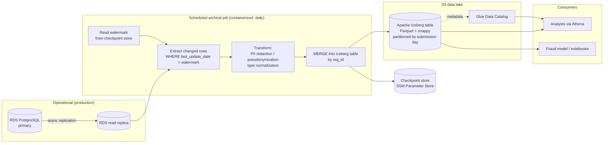

# Design Doc: Periodic Archival of the `request` Table to S3


## 0. Reviewer orientation (read this first)

Two facts grounded this design in reality rather than assumption, both established by inspecting the current `Request_Table` data, not by trusting the ticket:

1. **The table is not append-only.** Rows are edited after they are serviced/closed (observed: a row updated 40 days after its `serviced_date`). Any design must handle updates to historical rows, not just inserts.
2. **The source schema already drifts.** A `to_public` column exists in the data that wasn't in the original DDL, and `req_cat_id` carries multiple incompatible value shapes. Schema evolution is a present-tense problem, not a hypothetical.

Together with the likely future need to honor deletion requests, these requirements — **update, delete, evolve** — are what drive the central architectural choice (an Iceberg table, §3), independent of data volume.

**On volume:** the current table is ~290 rows. The performance/cost pressure described in the ticket is a *future* state. This doc therefore treats the work as **establishing the reusable archival pattern** (which generalizes to `volunteers`, `donations`, `matches` later) while keeping operational weight minimal. We pick the correct *table format* for the requirements, but we deliberately do **not** over-build tiering, sharding, or compute for 290 rows.


## 1. Problem statement and goals

This doc designs a periodic, one-directional archival pipeline that copies request rows out of the operational RDS PostgreSQL database into an S3 data lake that is durable, cheap to retain, queryable for analytics via Athena, and privacy-safe by default.

### Why
- The `request` table grows monotonically and sits on the hot matching path; query performance will degrade as it grows.
- Operational DB storage scales poorly (and expensively) for cold, rarely-touched rows.
- Analytics cannot safely run  fulfillment SLAs, geographic demand, volunteer reach, donor reporting against the production database.

### Goals: what "done" means
- A scheduled process extracts request rows into S3 in a columnar, queryable format.
- Analysts can query archived data through Athena without touching production.
- Updates and deletes to historical rows are reflected in the archive.
- The archive is privacy-safe by default: no raw free-text or direct identifiers leak to analytics.
- The pattern is documented well enough to be reused for the other operational tables.

### Non-goals (explicit)
- **Not** real-time CDC or streaming. Freshness is measured in hours, not seconds.
- **Not** a replacement for the operational DB. This is read-only, one-directional archival.
- **Not** the archival of `volunteers` / `donations` / `matches` — separate docs. This design notes where it generalizes.
- **Not** BI-tool selection.
- **Not** the implementation itself. This is design-only.


## 2. Requirements

### Functional
- **Which rows move:** all request rows are archived (the archive is the analytics-complete copy of the table). A future enhancement may purge *operational* rows once serviced + archived, but operational-side purging is out of scope for this doc, we only define the archive that makes it safe.
- **Cadence: daily.** Justification: the analytics consumers (SLA dashboards, donor/geographic reporting) operate on daily-or-coarser grain; none require intra-day freshness. Daily minimizes read-replica load and job cost. Hourly is available as a config change if a consumer later justifies it.
- **Incremental, not full-snapshot:** a watermark on `last_update_date` selects new and changed rows each run. Full re-extract is reserved for the one-time backfill and for explicit re-syncs.
- **Updates:** handled. Changed historical rows are re-emitted and merged by primary key (`req_id`).
- **Deletes:** handled. See §5 deletion policy. Deletes propagate to the archive.

### Non-functional
- **Freshness SLA:** archived data is no more than 24h + one job duration stale. Target job duration: minutes.
- **Cost ceiling:** negligible at current scale (see §8); dominated by the read replica. Design must keep S3/Athena/Glue costs linear and small.
- **Recovery on failure:** a failed run is safely retryable and resumes from the last committed watermark. No manual cleanup of partial data.
- **Idempotency:** re-running a window produces the same archive state (merge-by-key, atomic commits).

---

## 3. Proposed architecture

### 3.1 Overview



The flow: a daily containerized job reads the last committed watermark, SELECTs rows from the **read replica** where `last_update_date` exceeds it, applies PII and type transforms, and `MERGE`s the result into an **Apache Iceberg** table on S3 by `req_id`. Iceberg's commit is atomic, so a crash never leaves partial rows visible. The watermark advances only on a successful commit. Analysts query the Iceberg table through Athena via the Glue Data Catalog.

### 3.2 Extraction: watermark SELECT against a read replica

**Chosen:** scheduled watermark-based `SELECT` against an **RDS PostgreSQL read replica**, filtering on `last_update_date > :watermark`.

Rationale:
- Reading from the replica keeps all load off the hot matching path on the primary which is the core motivation.
- `last_update_date` (not `submission_date`, not `req_id`) is the correct watermark: it captures both new rows and edits to old ones. `req_id` is explicitly **not** chronological (the ID-generation trigger doesn't track insertion order), so it cannot be a watermark.
- Watermarks are timezone-safe: all timestamps are **UTC**, so day boundaries and watermark comparisons need no tz conversion. (This is documented in §4 so future maintainers don't reintroduce local-time bugs.)
- A small overlap window (re-scan the last N minutes each run) plus merge-by-key makes the extract robust to replica lag and clock skew without duplicating rows.

Tradeoff: a watermark SELECT cannot see a *hard delete* in the source (a deleted row simply stops appearing). Deletes are handled out-of-band — see §5.

### 3.3 Why Iceberg (the central tradeoff)

The obvious default is plain Parquet files under Hive-style date partitions. We reject it as the primary because the data violates its core assumptions:

| Requirement (observed in data) | Plain Parquet + Hive | Apache Iceberg |
|---|---|---|
| Update a historical row | Manual partition rewrite | Native `MERGE` |
| Delete a specific row (RTBF) | Manual rewrite, error-prone | Native row-level `DELETE` |
| Add/drop/rename a column upstream | Manual, breaks readers | Native schema evolution |
| Atomic commit on retry | Not guaranteed | Guaranteed (snapshot isolation) |
| Athena-queryable | Yes | Yes (Athena supports Iceberg) |

All three hard requirements — update, delete, evolve — are things Iceberg does natively and Parquet-on-Hive does by hand. **Iceberg is not chosen for scale; it's chosen because the table mutates and the schema drifts.** Operationally it adds modest conceptual weight, which is justified by removing a class of manual partition-surgery work the team would otherwise own forever and replicate across the other tables.

### 3.4 S3 layout
- **Bucket:** dedicated analytics lake bucket, e.g. `saayam-virginia-analytics` in **us-east-1** (matching the existing `saayam-virginia-private` region).
- **Table storage:** Iceberg-managed Parquet, **snappy** compression, target file size ~128 MB (Iceberg compaction will coalesce small files — relevant only once volume grows; at current size everything is one small file).
- **Partitioning:** Iceberg hidden partitioning by `day(submission_date)`. Partitioning on submission day matches how analytics slices time and bounds Athena scans. Region/country partitioning is deferred (current data is US-only; revisit when multi-country request volume is real — see §10).

### 3.5 Catalog + query layer
- **Glue Data Catalog** registers the Iceberg table.
- **Athena** is the analyst query surface. Notebooks already use SQL, so this is a small workflow shift, not a new paradigm.
- Existing consumers (the analytics notebook, the fraud model in `models/fraud_requests.py`) repoint from direct Postgres reads to Athena.

### 3.6 Orchestration
- A **containerized Python job on a daily schedule**, consistent with the team's existing container/deploy pattern (`Dockerfile`, `deployment.yaml`, `service.yaml`, `scripts/deploy/*`). Concretely: a scheduled task / k8s CronJob running the same image-build-and-deploy flow as the aggregator and categorizer.
- Rationale: match what the team already operates rather than introduce a new orchestrator. If the team later adopts Step Functions or MWAA for multi-table archival, this job slots in as a single task — noted in §6.

### 3.7 Lifecycle policy
Kept deliberately light given volume:
- S3 **Standard** for recent partitions.
- Transition to **Standard-IA** after 90 days, **Glacier Deep Archive** after 2 years (cold analytics data is rarely re-read).
- Hard expiry per the retention policy in §5.

Note: Iceberg metadata and manifests stay in Standard; only data files tier. Tiering is essentially free to specify now and only matters at volume.

---

## 4. Schema handling

### 4.1 Source → S3 type mapping

| Source column | Source type | Archive type | Note |
|---|---|---|---|
| `req_id` | VARCHAR | string | Primary key / merge key |
| `req_user_id` | VARCHAR | string | **Pseudonymized** (see §5) |
| `req_for_id` | INT | int | FK to `request_for` |
| `req_islead_id` | INT | int | FK |
| `req_cat_id` | VARCHAR(50) | **string** | **Not float.** Values like `4.3.1` are dotted hierarchical codes; float parsing corrupts them |
| `req_type_id` | INT | int | FK |
| `req_priority_id` | INT | int | FK |
| `req_status_id` | INT | int | FK |
| `req_loc` | VARCHAR | string | **Coarsened** (see §5) |
| `iscalamity` | BOOLEAN | boolean | |
| `req_subj` | VARCHAR | — | **Dropped** (free-text PII) |
| `req_desc` | VARCHAR | — | **Dropped** (free-text PII) |
| `req_doc_link` | TEXT | — | **Dropped** (links to private docs) |
| `audio_req_desc` | VARCHAR | — | **Dropped** (audio PII) |
| `submission_date` | TIMESTAMP | timestamp | **UTC**; partition source |
| `serviced_date` | TIMESTAMP | timestamp (nullable) | UTC |
| `last_update_date` | TIMESTAMP | timestamp | UTC; watermark source |
| `to_public` | BOOLEAN | boolean | |

Timestamps are timezone-naive in the source but are **UTC by convention**. They map to Iceberg `timestamp` and the UTC convention is documented here so downstream readers don't double-convert.

### 4.2 Schema evolution strategy
- **Additive (new column upstream, e.g. `to_public`):** Iceberg adds the column as nullable; old snapshots read back null for it. No reader breaks. This is the default and requires no manual migration.
- **Drop upstream:** never destructive in the archive. We stop populating the column and mark it deprecated in the catalog; historical data is retained.
- **Retype upstream:** add a new typed column, deprecate the old; never an in-place mutation. This preserves historical readability.
- **Unstable values within a type (e.g. `req_cat_id`):** archived as string verbatim; normalization/decoding is a *consumer-side* or downstream-derivation concern, not something the archival job silently "fixes."

---

## 5. PII and privacy

**Consumer-driven principle:** the analytics consumers (SLA, geographic demand, volunteer reach, donor reporting, fraud detection) need *aggregates and categories*, not identities or free text. We therefore **default-deny**: a column reaches the lake only if a consumer need justifies it. This matters more than usual here — requesters are a vulnerable population, and free-text fields were observed to contain self-identifying detail.

### 5.1 Per-column decision

| Column | Decision | Why |
|---|---|---|
| `req_id` | **Pass through** | Synthetic key; needed as the archive primary/merge key |
| `req_user_id` | **Pseudonymize** (HMAC-SHA256 with a KMS-held salt) | Preserves join/grouping ("how many requests per user") without exposing the real user id; salt in KMS prevents reversal |
| `req_for_id`, `req_islead_id`, `req_type_id`, `req_priority_id`, `req_status_id` | **Pass through** | Lookup-table FKs; low risk. Decode to labels at query time or via an optional derivation |
| `req_cat_id` | **Pass through (string)** | Category code; analytically essential, non-identifying |
| `iscalamity`, `to_public` | **Pass through** | Booleans; non-identifying |
| `req_loc` | **Coarsen** to normalized region (state/country), drop raw string | Geographic demand needs region granularity, not a precise address |
| `req_subj` | **Drop** | Free-text PII |
| `req_desc` | **Drop** | Free-text PII (observed self-identifying content). Non-PII derived features (length, language, category) can be produced by a separate, reviewed derivation path if a consumer needs them |
| `req_doc_link` | **Drop** | Points to private documents (observed `s3://saayam-virginia-private/...`) |
| `audio_req_desc` | **Drop** | Audio PII |
| timestamps | **Pass through** | Non-identifying; needed for time-series and watermarking |

### 5.2 Encryption & access control
- **At rest:** SSE-KMS with a dedicated CMK for the analytics bucket (mirrors the private bucket's posture).
- **In transit:** TLS for replica reads and S3 writes.
- **Access:** least-privilege IAM. The job has write; analysts have read via Athena. Bucket policy denies non-TLS and enforces the CMK.
- **Optional (future):** Lake Formation for column-level grants if any consumer is ever approved to see identifiers — the default lake carries none, so this isn't needed at launch.

### 5.3 Retention & deletion policy 

Since the policy was left to design discretion, this is a defensible default, flagged for override:
- **Retention:** archived rows retained **7 years**, then hard-expired via S3 lifecycle + an Iceberg expiry job.
- **Right-to-be-forgotten:** **honored, and propagated to the archive.** A deletion request triggers a row-level Iceberg `DELETE` on the requester's rows (matched via the pseudonym→user mapping held in the operational system). Because the lake stores no free text or direct identifiers, residual exposure after deletion is minimal by construction. Deletes run on a defined SLA (e.g. within the next daily cycle, or on-demand for legal requests).

This is the single most architecture-shaping decision in the doc; if  mandated to a different retention or a stricter deletion SLA, only the lifecycle numbers and the delete cadence change as the Iceberg foundation already supports it.

---

## 6. Alternatives considered

**A. AWS DMS (or Debezium) continuous CDC → S3.**
Pros: near-real-time; captures deletes natively. Cons: it's a continuously-running replication system with real operational weight, and real-time is an explicit non-goal. Overkill for a daily analytics archive. *Rejected* — cost and ops disproportionate to a daily-freshness requirement.

**B. RDS native snapshot export to S3 (Parquet).**
Pros: managed, no custom extract code, produces Parquet directly. Cons: full-snapshot only (no incremental), exports **every column including raw PII** with no redaction hook, and doesn't give a queryable mutable table (no update/delete/merge). We'd still need a transform+load stage on top. *Rejected* as primary — incompatible with default-deny PII and with incremental/mutable requirements. (Could serve as the one-time backfill mechanism if its output is piped through the same transform — noted in §9.)

**C. Third-party ELT (Fivetran / Airbyte).**
Pros: fast to stand up, managed connectors and schema-drift handling. Cons: per-row/credit pricing, another vendor in the trust boundary for sensitive data, and redaction would happen *after* PII has already left the DB into the vendor's pipeline. *Rejected* — privacy posture and recurring cost; not worth it for one table on a daily cadence.

---

## 7. Failure modes and observability

- **Partial failure mid-run:** Iceberg commits atomically; uncommitted data files are never visible to readers. A crash leaves the table at the last good snapshot.
- **Watermark safety:** the watermark advances **only after** a successful commit, persisted in SSM Parameter Store. A failed run re-reads the same window next time.
- **Duplicate prevention on retry:** `MERGE` by `req_id` is idempotent; re-processing an overlapping window updates rather than duplicates rows.
- **Replica lag / clock skew:** a small re-scan overlap window each run guarantees no row is missed at a boundary; merge dedupes the overlap.
- **Source delete invisibility:** watermark SELECT can't observe hard deletes; the §5 deletion flow handles these explicitly rather than inferring them.
- **Observability:** CloudWatch metrics (rows extracted, rows merged, run duration, watermark lag), structured logs, and alerts on (a) job failure, (b) zero rows when rows were expected, (c) watermark lag exceeding the freshness SLA. **On-call ownership: Data Engineering.**
- **Data validation gate:** since production data is assumed clean (no test rows), a lightweight pre-load assertion (non-null keys, parseable timestamps, known `req_status_id` domain) fails the run loudly rather than archiving malformed data silently.

---

## 8. Cost estimate

At current scale the pipeline is effectively free; cost is dominated by the read replica, and S3/Glue/Athena are rounding errors. Figures are rough monthly, us-east-1.

| Component | Current (~290 rows) | 10× | Notes |
|---|---|---|---|
| S3 storage | < $0.01 | < $0.01 | KB-to-MB of Parquet |
| S3 requests | < $0.01 | < $0.01 | One daily write |
| Glue Data Catalog | $0 | $0 | First 1M objects free |
| Athena scans | < $0.01 | < $0.01 | $5/TB; scans are KB |
| Job compute | < $1 | < $1 | Minutes/day of a small container |
| RDS read replica | ~$12–15 *or* $0 marginal | ~$12–15 | Dominant cost; **$0 if an existing replica is reused** |
| **Total** | **~$13/mo (or ~$1 if replica reused)** | **~$14/mo** | Cost is flat and replica-bound, not data-bound, at these scales |

The honest headline: **this pipeline's cost is the read replica, full stop.** Storage and query costs stay negligible well beyond 10×. The economic justification is the *operational DB* relief (keeping cold rows out of the hot path), not S3 savings — which is consistent with §0's framing that this is a pattern investment.

---

## 9. Rollout plan

1. **Build (dev):** implement extract→transform→load against a dev copy; validate PII transforms and type mappings on the existing sample dataset.
2. **Shadow run:** point the job at the read replica, write to a *dev* analytics bucket/table. Compare archived row counts and a sample diff against source. No consumer impact.
3. **Historical backfill:** one-time full extract (optionally via RDS snapshot export, piped through the same transform so PII rules apply), loaded into the Iceberg table.
4. **Enable incremental schedule:** turn on the daily job against the production analytics bucket.
5. **Cutover consumers:** repoint the notebook and fraud model from direct Postgres to Athena; verify queries.
6. **Decommission:** none required — there is no existing archival process to retire.

**Rollback:** the pipeline is read-only against a replica and additive to a separate bucket; it never writes to the operational DB. Rollback is simply *stop the job* (and, if needed, drop the analytics table/bucket). This zero-blast-radius property on the operational side is a deliberate safety feature of the design.

---

## 10. Open questions

1. **Retention duration & deletion SLA** — §5.3 picks 7 years + RTBF-honored as a default; needs confirmation.
2. **`req_loc` coarsening granularity** — state? country? admin region? Depends on the resolution geographic-demand analytics actually need.
3. **Lookup decoding** — decode FK ids (`req_type_id`, etc.) to labels inside the pipeline, or leave as ids and join at query time? Leaning join-at-query to keep the archive faithful and the lookups authoritative.
4. **`to_public` and consent** — does `to_public = true` represent requester consent to broader data use? If so, PII handling could be relaxed per-row for those rows. Not assumed here (all current rows are `false`, and visibility ≠ data-sharing consent); flagged as a possible future refinement.
5. **Linked documents** — `req_doc_link` / `audio_req_desc` point at private S3 objects with their own lifecycle. Do those artifacts need a parallel retention/deletion treatment to stay consistent with request deletion? Likely yes; out of scope here but should be its own design.
6. **Generalization** — `volunteers` / `donations` / `matches` will reuse this pattern. Confirm the shared bucket/catalog/job-template structure before building, so the second table is configuration, not a rewrite.
```
