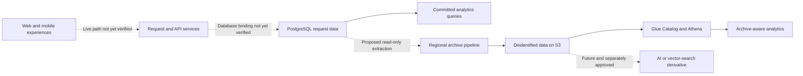
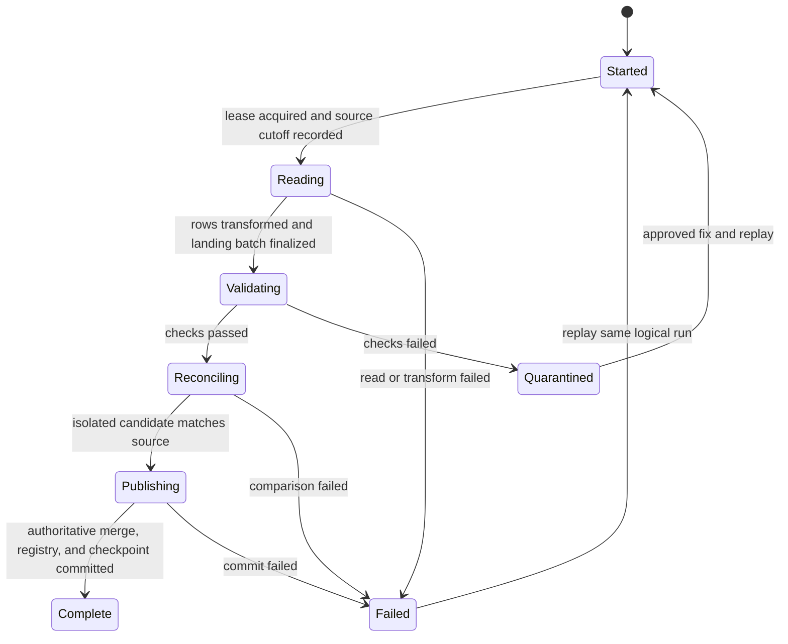

# Design proposal: Moving older `request` records from PostgreSQL to Amazon S3

> **Status: Draft for team-lead review. This document proposes a design. It does not approve implementation or authorize deleting production data.**

## Executive summary

- **Problem:** Older completed requests can keep growing in PostgreSQL, while analytics and product features may still need their history.
- **Recommendation:** Copy approved, deidentified fields into a regional S3/Iceberg archive through a daily read-only pipeline.
- **Key correction:** Find rows crossing the age threshold separately from rows that were recently updated, so unchanged requests are not missed.
- **Privacy boundary:** Keep free text, precise locations, document/audio links, and unapproved person fields out of the analytics copy.
- **What stays off:** No raw-data vault, AI access, consumer switch, or PostgreSQL deletion is authorized by this draft.
- **Before deletion:** Migrate consumers, understand child-table effects, reconcile the archive, prove recovery, obtain policy/database approval, and recheck the exact live row.
- **Decisions needed now:** Confirm the production database/regions, request lifecycle and age rule, retention/erasure policy, historical consumers, and accountable owners.
- **Reviewer request:** Decide whether this becomes the canonical draft, correct its facts, and assign one person and due date to every open question.
- **Review process:** Use this draft pull request for initial feedback, revise it, allow the issue's three-business-day pre-read, and obtain cross-team approval before merge.

This summary can be shared in Slack with a link to the rendered document. Avoid pasting the entire file into a message because Slack may not render its Markdown tables or Mermaid diagrams correctly.

## Document overview

| Field                     | Value                                                                                                                                                  |
| ------------------------- | ------------------------------------------------------------------------------------------------------------------------------------------------------ |
| Related work              | [saayam-for-all/data issue #175](https://github.com/saayam-for-all/data/issues/175)                                                                    |
| Version                   | `0.4`                                                                                                                                                  |
| Evidence reviewed through | 2026-08-18                                                                                                                                             |
| Intended readers          | Product and privacy reviewers, Data Engineering, Database, DevSecOps, Data Analytics, Request/API, quality assurance (QA), AI, and future contributors |
| Proposed owner            | Data Engineering; the team lead still needs to name an accountable person                                                                              |
| Required approvals        | Data Engineering, Database, DevSecOps, Data Analytics, and Product/Privacy                                                                             |
| Repository impact         | Documentation only. This draft changes no runtime code, infrastructure, database, or production data.                                                 |
| Review timing             | This draft pull request is for initial feedback. Formal approval should follow the issue's three-business-day pre-read and at least one revision.      |

### How to read this draft

You do not need to read every section before joining the discussion.

- For the proposal and the decisions we need, read Sections 1 and 2.
- For product behavior, privacy, or historical reporting, read Sections 3, 6, 11, 12, and 15.
- To build or operate the pipeline, read Sections 7 through 17.
- To understand the earlier pull requests, read Sections 19 and 20.
- To help resolve blockers, read Section 21.

Throughout the document:

- **Confirmed** means a linked repository, issue, pull request, or official vendor document supports the statement. It does not automatically mean the same thing is deployed in production.
- **Proposed** means this draft recommends it, but the team has not approved it.
- **Working assumption** means we need a temporary value to discuss the design. It must be replaced with evidence.
- **Still unknown** means the team must not guess; an owner must confirm it.

In this draft, **must** marks a safety or acceptance requirement. **Should** is the recommended default unless the team records a reason to choose differently. **May** is optional.

---

## 1. The proposal in plain English

### 1.1 What problem are we solving?

Saayam stores requests in a PostgreSQL table named `request`. Issue #175 says this operational table can keep growing even though older completed requests are rarely changed. The desired outcome is to keep older data in a lower-cost, queryable archive on Amazon S3 and, only when it is proven safe, reduce the old data kept in the operational database.

This is more than a “copy rows to S3” task:

- Existing analytics code reads the PostgreSQL `request` table directly.
- Product or API features may need older requests after they leave PostgreSQL.
- A request can be updated, reopened, deleted, or receive related records after it first looks complete.
- Request descriptions, locations, document links, and user identifiers may contain personal or sensitive information.
- Deleting the parent request can affect comments, assignments, ratings, guest details, additional information, or attachment references.

The public repositories do not tell us the deployed database version, production row counts, active regions, exact request lifecycle, or approved retention policy. Those facts must be confirmed before implementation approval.

### 1.2 What are we recommending?

We propose a daily, region-local pipeline with four separate jobs:

1. Find completed requests that have just become old enough to archive.
2. Capture later changes to requests already in the archive.
3. Reconcile PostgreSQL and the archive so missing or conflicting records are detected.
4. Produce evidence for a separate deletion process. Deletion stays off until the team explicitly approves it.

The proposed first implementation uses a scheduled container job, Amazon S3, Apache Iceberg, the AWS Glue Data Catalog, and Amazon Athena. It writes only an allowlisted, deidentified analytics dataset. A restricted full-fidelity copy is not enabled unless Product/Privacy approves a specific purpose, fields, retention period, access policy, residency policy, and erasure process.

### 1.3 The most important correctness rule

Age and change history are different things.

A request may be closed on January 1 and never change again. On April 1 it becomes 90 days old even though its “last updated” timestamp still says January 1. A process that asks only for “old rows updated since the last run” can miss that request forever.

For that reason, this proposal keeps separate progress for:

- requests crossing the age threshold;
- changes to requests already archived;
- source-to-archive reconciliation; and
- authorization to delete from PostgreSQL.

### 1.4 Why deletion is a separate decision

Copying data to S3 creates an analytical copy. It does not reduce PostgreSQL storage by itself. Deleting source rows may provide database relief, but only after:

- current consumers can read the correct history without those rows;
- related-table and cascade behavior is understood;
- the archive is reconciled and stable;
- backup and selective restore have been tested;
- retention, legal hold, erasure, and residency decisions are approved; and
- a row-comparable guard proves the live source row still matches the approved archived content.

Until every gate passes, the pipeline remains read-only.

### 1.5 Recommended starting point

- Treat `(source region, request ID)` as the source identity because request IDs may not be globally unique.
- Keep each region's database, archive bucket, encryption keys, catalog, control state, and compute in that region unless leadership approves a cross-region policy.
- Use a scheduled container task for normal extraction because runtime, memory, networking, and retry behavior are more predictable than a small Lambda function. Reconsider this after measuring production volume.
- Use Aurora snapshot or live-cluster export only as a candidate backfill source where the deployed engine supports it. Normalize and compact that output before publication.
- Use an Iceberg v2 table for curated current state and version history because updates, reopenings, erasure, schema evolution, and Athena queries are required.
- Keep immutable, versioned Parquet batches as the documented fallback if the team does not approve Iceberg.
- Keep a full-fidelity vault off by default.
- Keep source deletion off by default, controlled by a separate role, process, approval, and kill switch.

### 1.6 Decisions the team lead should help assign

These are discussion decisions, not approvals already made.

| No. | Question                                                                                 | Recommended starting point                                                                                                        | Why it matters                                                                  |
| --: | ---------------------------------------------------------------------------------------- | --------------------------------------------------------------------------------------------------------------------------------- | ------------------------------------------------------------------------------- |
|   1 | Should this become the one canonical design that replaces the scattered drafts?          | Yes, after team feedback and revision                                                                                             | Prevents another duplicate PR with no clear owner                               |
|   2 | Which branch and path should the document PR use?                                        | This draft uses `main` and `data-engineering/docs/requests-s3-archival-design.md`; the lead must still resolve the disconnected `dev` policy before merge | Avoids silently treating contradictory repository guidance as approved policy  |
|   3 | Which regions and environments actually contain request data?                            | Process each active region independently                                                                                          | Determines residency, infrastructure, identity, and cost                        |
|   4 | What database schema and update/delete behavior are deployed?                            | Database supplies evidence through issue #228 and reconciles overlapping schema work                                              | Determines whether scheduled extraction is safe                                 |
|   5 | Which states are terminal, can a request reopen, and how late can child records arrive?  | Product and Request/API define the lifecycle                                                                                      | Determines age eligibility and deletion safety                                  |
|   6 | Is 90 days after terminal service the correct archive threshold?                         | Use 90 days only as a working assumption                                                                                          | Affects product access, database relief, and cost                               |
|   7 | Does the project actually require deletion from PostgreSQL?                              | Yes only if database relief is an explicit objective                                                                              | Without deletion, this is an export rather than full archival                   |
|   8 | Is a restricted full-fidelity copy required?                                             | No, unless a concrete restore or future AI use is approved                                                                        | Avoids retaining unnecessary sensitive text and links                           |
|   9 | Should the curated table use Iceberg?                                                    | Yes, provisionally                                                                                                                | Updates, deletes, version history, and Athena access need a defined state model |
|  10 | Who owns each decision, implementation boundary, approval, and on-call duty?             | One named person per team boundary                                                                                                | Work cannot be reviewed or operated by an unnamed group                         |
|  11 | Where should run progress, leases, checkpoints, and deletion evidence live?              | Region-local DynamoDB, subject to cost and ownership review                                                                       | Safe retries and concurrency need durable control state                         |
|  12 | Will active Iceberg storage use S3 Versioning, and when may old object versions expire?  | Decide from rollback, erasure, legal, and cost needs                                                                              | Incorrect lifecycle rules can retain erased data or break the table             |
|  13 | What freshness, source-load, monthly-cost, recovery, and on-call targets are acceptable? | Use measured targets before formal approval                                                                                       | Capacity and acceptance tests need numeric limits                               |

### 1.7 Main risks

| No. | Risk                                                   | What could happen                                                  | How this proposal contains it                                |
| --: | ------------------------------------------------------ | ------------------------------------------------------------------ | ------------------------------------------------------------ |
|   1 | Production differs from repository schemas             | Rows are missed or transformed incorrectly                         | Confirm the deployed contract and stop on unexpected changes |
|   2 | Age is combined with an update watermark               | An unchanged row can be missed forever                             | Scan age eligibility separately from later changes           |
|   3 | Rows are deleted before consumers move                 | Analytics or product history becomes incomplete                    | Compare old and new results before deletion                  |
|   4 | Parent deletion cascades to child records              | Comments, assignments, ratings, or guest information can disappear | Audit foreign keys and define aggregate behavior first       |
|   5 | Free text or links enter the analytics table           | Sensitive information is exposed                                   | Use a fail-closed column allowlist                           |
|   6 | Ordinary S3 lifecycle rules touch active Iceberg files | Queries or snapshots can break                                     | Let Iceberg-aware maintenance manage active files            |
|   7 | Region or timezone is guessed                          | Residency or age calculations can be wrong                         | Keep processing regional and confirm each timestamp          |
|   8 | Mock CSV data is used for sizing                       | Cost and performance estimates are invalid                         | Require production measurements and a 10-times scenario      |
|   9 | Updates or hard deletes are not observable             | Archive current state becomes stale                                | Confirm triggers/audit/change capture and reconcile          |
|  10 | The repository has no pre-merge test gate              | Regressions can reach deployment                                   | Add deterministic automated tests and PR checks              |

---

## 2. Why this work is needed

### 2.1 The requested outcome

**Confirmed:** [Issue #175](https://github.com/saayam-for-all/data/issues/175) asks for a design that moves older request data to S3 so it remains available for analysis while reducing risk and load on the operational database. It asks for architecture, alternatives, schema and privacy handling, failure recovery, cost at current scale and 10 times scale, testing, rollout, and an implementation plan.

The issue asks for a design document, not pipeline code. This draft separates what can be decided now from facts that require Database, Product/Privacy, DevSecOps, Analytics, and Request/API input.

### 2.2 What success looks like

1. Eligible request history is durable, queryable, and tied to its source region.
2. The archive produces one unambiguous current state after retries, updates, reopenings, and approved erasure.
3. Analysts use a stable deidentified dataset instead of querying old operational rows directly.
4. Source data is removed only after archive proof, consumer migration, database approval, and recovery proof.
5. New or changed source fields do not silently enter the archive.
6. Every safety promise has a corresponding test and delivery step.
7. The design can later support other entities or approved AI derivatives without opening raw request data now.

### 2.3 What this design does not do

- It does not build or deploy the pipeline.
- It does not approve deletion from production.
- It does not select a business-intelligence visualization tool.
- It does not provide real-time streaming analytics in the first release.
- It does not automatically archive every child table; it identifies why those tables affect deletion safety.
- It does not replace the request service or PostgreSQL database.
- It does not interpret `to_public` as consent.
- It does not copy binary documents or audio into the curated analytical data.
- It does not enable vector search, retrieval-augmented generation, third-party sharing, or AI access to raw request text.

---

## 3. What we know about Saayam today

This section connects the archive to the wider Saayam project. “Repository code exists” does not mean “the same code is deployed.” Where deployment is not proven, the document says so.

### 3.1 Current and possible future flow



In plain language: committed analytics code queries a table named `request`, but the public repositories do not prove the live user-interface-to-service-to-database path. The solid arrow to analytics means code exists. Dotted arrows mean either the production path is unverified or the capability is proposed. The future AI arrow remains disabled unless Product/Privacy approves a separate minimized data contract.

### 3.2 Existing consumers and dependencies

| No. | Area                                      | What the audit found                                                                                                                                                                                                         | Why it matters                                                                    |
| --: | ----------------------------------------- | ---------------------------------------------------------------------------------------------------------------------------------------------------------------------------------------------------------------------------- | --------------------------------------------------------------------------------- |
|   1 | Key performance indicator (KPI) analytics | [`data-engineering/src/kpi_api_analytics.py`](https://github.com/saayam-for-all/data/blob/main/data-engineering/src/kpi_api_analytics.py) reads totals, status, and service-level measures from `request`.                   | Deleting old rows can change metrics.                                             |
|   2 | Data Analytics KPI Lambda                 | [`data-analytics/lambda_functions/kpi_api_analytics.py`](https://github.com/saayam-for-all/data/blob/main/data-analytics/lambda_functions/kpi_api_analytics.py) queries 7-day, 30-day, 1-year, 2-year, and snapshot periods. | Long-range results need a hot-plus-cold data source.                              |
|   3 | Beneficiary trends                        | [`beneficiariesTrendAnalysis.py`](https://github.com/saayam-for-all/data/blob/main/data-analytics/lambda_functions/beneficiariesTrendAnalysis.py) reads request dates, users, and countries.                                 | Regional constants and legacy timestamps need review.                             |
|   4 | Daily aggregate metrics                   | [`aggregate-daily-metrics/helpers.py`](https://github.com/saayam-for-all/data/blob/main/data-engineering/src/aggregate-daily-metrics/helpers.py) counts rows and statuses.                                                   | Reports need equivalence testing before cutover.                                  |
|   5 | Web and product history                   | The webapp has request service, detail, and history-related code; product issues propose completed/all-request views.                                                                                                        | Product owners must say how much history users need.                              |
|   6 | Database                                  | Candidate DDL and open changes affect identity, timestamps, and related tables.                                                                                                                                              | Repository schemas are still moving and are not production proof.                 |
|   7 | DevSecOps                                 | Current public workflows update selected Lambda functions; no archive infrastructure was found.                                                                                                                              | Infrastructure, encryption, networking, monitoring, and operations need an owner. |
|   8 | AI                                        | Public AI code is a proof of concept; no archive-to-vector contract exists.                                                                                                                                                  | Future AI is not a reason to retain all raw text now.                             |

### 3.3 Who needs to decide what

| Topic                                                                         | Accountable group         | Evidence or approval needed                                                |
| ----------------------------------------------------------------------------- | ------------------------- | -------------------------------------------------------------------------- |
| Terminal states, reopening, late comments/ratings, and historical UI behavior | Request/API and Product   | Approved lifecycle and history rules                                       |
| Deployed schema, indexes, timestamps, database version, replica, and regions  | Database                  | Schema fingerprint, query plans, engine/version, topology, and region list |
| Extraction, transformation, publication, reconciliation, and archive contract | Data Engineering          | Reviewed technical design and implementation ownership                     |
| Historical metrics and consumer migration                                     | Data Analytics            | Query equivalence and cutover acceptance                                   |
| S3, encryption keys, roles, network, catalog, orchestration, monitoring       | DevSecOps                 | Infrastructure as code, security review, and operating model               |
| Retention, legal hold, erasure, residency, and permitted fields               | Product/Privacy           | Written policy decisions                                                   |
| Test evidence and release readiness                                           | QA plus every owning team | Shared acceptance record                                                   |
| Any future vector or AI use                                                   | AI plus Product/Privacy   | Separate purpose-limited, minimized contract                               |

---

## 4. What we verified—and what remains unknown

For a quick read, remember five findings:

1. Committed analytics code depends on request history in PostgreSQL.
2. The Virginia, Ireland, and mock schemas disagree, and none proves the production shape.
3. Earlier design pull requests are still open and unreviewed; none is known to have been rejected or merged.
4. Required database, product/privacy, consumer, and infrastructure decisions remain open or mislinked.
5. The fixture has about 290 generated rows and must never be used as production size or cost evidence.

The detailed audit below is a **maintainer and evidence reference**. Non-technical readers may skip from this summary to Sections 4.5 and 4.6, which list the assumptions and decisions the team still owes.

### 4.1 How the audit was performed

The audit was read-only and reproducible:

1. We enumerated all 104 tracked files on `saayam-for-all/data` `main` at commit `13360c8`, then inspected request-related Python, schemas, generated fixtures, documentation, workflows, tests, analytics consumers, and configuration.
2. We re-read issue #175, issue #177, both attached design documents, all six obvious standalone design pull requests (PRs), mixed-scope PR #172, and incidental branch-carrier PR #231. We checked patches, commits, base branches, comments, reviews, checks, workflow runs, and merge state as observed on 2026-08-18.
3. We inspected public evidence from the `database`, `request`, `api`, `webapp`, `devsecops`, `ai`, and `prod` repositories.
4. We checked material AWS and PostgreSQL claims against official documentation in Section 22.
5. We did not access production data, cloud accounts, secrets, or private repositories. Public code and mock data describe intent; they do not prove deployment.

| Repository  | Branch | Audited commit                             |
| ----------- | ------ | ------------------------------------------ |
| `data`      | `main` | `13360c85fbde65446414b9a3c8c723cef3b8cf71` |
| `database`  | `main` | `c41785842162cdedd23f009feacdca311c657d1d` |
| `request`   | `main` | `9f463f5bc17665de6f4f8a2b4b39a9fb6b20c3e3` |
| `api`       | `main` | `e70c8c2ddedd53e895ad38e21181bcc99c08022f` |
| `webapp`    | `main` | `c7b8189044098273937221ca522ee41c73712aee` |
| `devsecops` | `main` | `ebb6308397ce3adb0a06776c3f308d5caac6fadd` |
| `ai`        | `main` | `e7b553f1452fd5c1e49f2f82bd2a0cf51a5e43cd` |
| `prod`      | `main` | `8b2f0b80c2be7bb944ac6aceec18c758f7f93e75` |

### 4.2 Confirmed findings

| No. | Finding                                                                                                                                                                                                                                                                                                                                                                                                                                                           | Why it matters                                                                                   |
| --: | ----------------------------------------------------------------------------------------------------------------------------------------------------------------------------------------------------------------------------------------------------------------------------------------------------------------------------------------------------------------------------------------------------------------------------------------------------------------- | ------------------------------------------------------------------------------------------------ |
|   1 | The data repository documents Aurora PostgreSQL, S3, Lambda, Python, and local-first mocked AWS development.                                                                                                                                                                                                                                                                                                                                                      | Candidate technology is not proof of the live stack.                                             |
|   2 | The schema snapshot describes an 18-column singular table named `request`.                                                                                                                                                                                                                                                                                                                                                                                        | The issue's plural wording should not create a new source name.                                  |
|   3 | `Request_Table.csv` has about 290 generated/mock rows.                                                                                                                                                                                                                                                                                                                                                                                                            | It is a test fixture, never production scale or cost evidence.                                   |
|   4 | Virginia data definition language (DDL) uses `last_update_date`, has no general update trigger, and lacks `to_public`. Ireland SQL uses `last_updated_at`, includes `to_public`, and defines an update trigger.                                                                                                                                                                                                                                                   | Extraction cannot assume one timestamp contract.                                                 |
|   5 | Database issue [#228](https://github.com/saayam-for-all/database/issues/228) remains open and requests deployed DDL/indexes, scale, version, replica details, and update guarantees.                                                                                                                                                                                                                                                                              | These inputs are required before implementation approval.                                        |
|   6 | Regional ID work remains open in database issue [#239](https://github.com/saayam-for-all/database/issues/239) and database PR [#244](https://github.com/saayam-for-all/database/pull/244).                                                                                                                                                                                                                                                                        | A request ID alone may not be globally unique.                                                   |
|   7 | The data repository has no pre-merge test workflow; its active workflow deploys selected Lambda code after merge to `main`.                                                                                                                                                                                                                                                                                                                                       | Implementation needs a new test gate.                                                            |
|   8 | Six standalone design PRs—[#185](https://github.com/saayam-for-all/data/pull/185), [#186](https://github.com/saayam-for-all/data/pull/186), [#188](https://github.com/saayam-for-all/data/pull/188), [#206](https://github.com/saayam-for-all/data/pull/206), [#213](https://github.com/saayam-for-all/data/pull/213), and [#244](https://github.com/saayam-for-all/data/pull/244)—are open and unmerged, with no submitted reviews. PR #188's document is empty. | There is fragmentation, but no evidence of maintainer rejection or failed CI.                    |
|   9 | No merged or closed-unmerged issue #175 archival PR was found.                                                                                                                                                                                                                                                                                                                                                                                                    | A canonical proposal is still needed.                                                            |
|  10 | Mixed-scope PR [#172](https://github.com/saayam-for-all/data/pull/172) carries the same design later isolated in PR #185 and conflicts with `main`. PR [#231](https://github.com/saayam-for-all/data/pull/231) incidentally carries PR #188's empty file.                                                                                                                                                                                                         | Branch-history carriers are not additional approved designs.                                     |
|  11 | `CONTRIBUTING.md` says PRs target `dev`, but public `dev` is a separate initial-commit history. Setup/deployment and every archival PR use `main`.                                                                                                                                                                                                                                                                                                                | The lead must confirm the base branch. Wrong base was not the proven reason earlier PRs stalled. |
|  12 | Data issue [#177](https://github.com/saayam-for-all/data/issues/177) closed with all five database-input checkboxes unchecked.                                                                                                                                                                                                                                                                                                                                    | Its missing inputs remain open work.                                                             |
|  13 | Database issue #228's bare `#175` resolves to unrelated database PR [#175](https://github.com/saayam-for-all/database/pull/175), not data issue #175.                                                                                                                                                                                                                                                                                                             | The link should use the full cross-repository URL.                                               |
|  14 | Database issue [#224](https://github.com/saayam-for-all/database/issues/224) proposes creator, beneficiary, and lead-volunteer fields.                                                                                                                                                                                                                                                                                                                            | Person fields and the contract are changing.                                                     |
|  15 | Database issue [#247](https://github.com/saayam-for-all/database/issues/247) attaches a proposed migration that renames fields, adds person foreign keys and an update trigger, and changes request-ID generation. It has no PR and is not production evidence.                                                                                                                                                                                                   | Database must reconcile it with issues #224/#239 and PR #244.                                    |
|  16 | Analytics code queries `request` directly, including historical periods.                                                                                                                                                                                                                                                                                                                                                                                          | Purging source rows without migration would truncate results.                                    |
|  17 | Beneficiary-trend code mixes some Ireland and Virginia constants and expects a legacy timestamp name.                                                                                                                                                                                                                                                                                                                                                             | Regional behavior needs confirmation.                                                            |
|  18 | Product issues and web code suggest historical views and delete behavior, but deployment and semantics remain unknown.                                                                                                                                                                                                                                                                                                                                            | Historical access and erasure need Product/API input.                                            |
|  19 | No deployable archive infrastructure was found in the audited public trees; DevSecOps issue [#75](https://github.com/saayam-for-all/devsecops/issues/75) is open.                                                                                                                                                                                                                                                                                                 | Infrastructure and operations are new work.                                                      |
|  20 | Public Request and API repositories do not prove the deployed request-service/archive-read boundary.                                                                                                                                                                                                                                                                                                                                                              | Product cutover cannot be based on guesses.                                                      |
|  21 | Public privacy material does not define archive retention or erasure; product issue [#88](https://github.com/saayam-for-all/prod/issues/88) remains open.                                                                                                                                                                                                                                                                                                         | The system cannot invent policy.                                                                 |
|  22 | The knowledge-transfer document describes PostgreSQL → S3 → vectorization → vector database → AI as future work.                                                                                                                                                                                                                                                                                                                                                  | Future AI compatibility is useful, but raw-data access is not approved.                          |

### 4.3 Related work that can affect this design

Only data issue #177 is formally cross-referenced from issue #175's timeline. Other items are intended or inferred dependencies because they change source schema, consumers, privacy, or deletion behavior.

| Relationship                 | Work                                                                                                                                                                                                                                                                                                                          | Connection                                                                             | What should happen                                  |
| ---------------------------- | ----------------------------------------------------------------------------------------------------------------------------------------------------------------------------------------------------------------------------------------------------------------------------------------------------------------------------- | -------------------------------------------------------------------------------------- | --------------------------------------------------- |
| Formal cross-reference       | [data #177](https://github.com/saayam-for-all/data/issues/177)                                                                                                                                                                                                                                                                | Original database-input task; closed incomplete                                        | Carry every missing input into discovery            |
| Intended but mislinked       | [database #228](https://github.com/saayam-for-all/database/issues/228)                                                                                                                                                                                                                                                        | Requests deployed schema, indexes, scale, version, replica, and update guarantees      | Fix its URL and keep it open until evidence arrives |
| Database schema and identity | [database #224](https://github.com/saayam-for-all/database/issues/224), [#239](https://github.com/saayam-for-all/database/issues/239), [#247](https://github.com/saayam-for-all/database/issues/247), [PR #244](https://github.com/saayam-for-all/database/pull/244)                                                          | Change names, person references, update behavior, and regional IDs                     | Reconcile proposals and supply deployed evidence    |
| Related tables               | [database #196](https://github.com/saayam-for-all/database/issues/196), [#248](https://github.com/saayam-for-all/database/issues/248), [#250](https://github.com/saayam-for-all/database/issues/250)                                                                                                                          | Change additional information, comments/assignments, foreign keys, cascades, and purge | Inventory deployed child DDL and decide behavior    |
| Analytics                    | [data #138](https://github.com/saayam-for-all/data/issues/138), [#146](https://github.com/saayam-for-all/data/issues/146), [#160](https://github.com/saayam-for-all/data/issues/160), [#181](https://github.com/saayam-for-all/data/issues/181), closed [#203](https://github.com/saayam-for-all/data/issues/203)             | Current or planned APIs read request history or related data                           | Include owners and prove equivalence                |
| Web and Product              | [webapp #1539](https://github.com/saayam-for-all/webapp/issues/1539), [#1589](https://github.com/saayam-for-all/webapp/issues/1589), [#1700](https://github.com/saayam-for-all/webapp/issues/1700), [prod #115](https://github.com/saayam-for-all/prod/issues/115), [#118](https://github.com/saayam-for-all/prod/issues/118) | History, KPIs, and deletion affect read and erasure contracts                          | Confirm history and deletion semantics              |
| Request service              | [request #17](https://github.com/saayam-for-all/request/issues/17), [#53](https://github.com/saayam-for-all/request/issues/53)                                                                                                                                                                                                | Comments and attachments may arrive late or have separate retention                    | Define late-write and asset behavior                |
| Policy and infrastructure    | [prod #88](https://github.com/saayam-for-all/prod/issues/88), [devsecops #75](https://github.com/saayam-for-all/devsecops/issues/75)                                                                                                                                                                                          | Retention/privacy and least-privilege infrastructure remain unresolved                 | Obtain decisions and owners                         |
| Future extension             | [AI #83](https://github.com/saayam-for-all/ai/issues/83)                                                                                                                                                                                                                                                                      | Structured-data search is discussed but raw request use is not approved                | Keep AI access disabled pending separate approval   |

### 4.4 Where the schemas disagree

| Topic                  | Data snapshot      | Virginia SQL                                         | Ireland SQL                                | Decision needed                                          |
| ---------------------- | ------------------ | ---------------------------------------------------- | ------------------------------------------ | -------------------------------------------------------- |
| Source table           | `request`          | `request`                                            | `request`                                  | Use the singular source name.                            |
| Update field           | `last_update_date` | `last_update_date`                                   | `last_updated_at`                          | Confirm deployed regional adapters.                      |
| Update guarantee       | Not described      | No general update trigger                            | Update trigger defined                     | Confirm what actually runs.                              |
| `to_public`            | Present            | Absent                                               | Present                                    | Confirm presence and meaning; it is not consent.         |
| Timestamp timezone     | No timezone        | `TIMESTAMP`                                          | No timezone; only one default mentions UTC | Confirm each field before computing age.                 |
| Guest details          | Mock metadata      | `request_guest_details`                              | `request_other_details` with differences   | Confirm deployed child model and erasure.                |
| Extraction indexes     | Not captured       | No archive index in table file                       | Not established                            | Measure plans before changing indexes.                   |
| Proposed person fields | Not represented    | Issue #224 proposes new person references            | Migration unknown                          | Keep legacy, proposed, and confirmed contracts separate. |
| Proposed migration     | Not represented    | Issue #247 attachment changes fields/FKs/trigger/IDs | Not represented                            | Reconcile proposals and show deployment evidence.        |

### 4.5 Working assumptions

| No. | Temporary assumption                            | Risk                                                          | Who confirms it            |
| --: | ----------------------------------------------- | ------------------------------------------------------------- | -------------------------- |
|   1 | One run per day is fresh enough.                | Reports may need more frequent updates.                       | Analytics and Product      |
|   2 | Cold age begins 90 days after terminal service. | Data may move too early or provide too little relief.         | Product, Privacy, Database |
|   3 | A regional read replica is available.           | It may not exist or may add cost; primary reads may add load. | Database and DevSecOps     |

### 4.6 Facts still needed before approval

| No. | Unknown                                                                                                         | Risk if guessed                                     | Owner                         |
| --: | --------------------------------------------------------------------------------------------------------------- | --------------------------------------------------- | ----------------------------- |
|   1 | Deployed database service, major version, topology, and regions                                                 | Unsupported behavior may be selected.               | Database                      |
|   2 | Row count, table/index size, row sizes, daily changes/deletes, and 10-times outlook                             | Invalid cost and capacity.                          | Database                      |
|   3 | Terminal statuses, reopening, and late-child window                                                             | Active data may be archived or deleted.             | Request/API and Product       |
|   4 | Whether hard deletes occur and where erasure starts                                                             | Deleted data may remain in archive.                 | Database, Product, Privacy    |
|   5 | Retention, legal hold, erasure time, residency, and recovery targets                                            | Policy or recovery failure.                         | Product/Privacy               |
|   6 | Which UI/API consumers need older rows                                                                          | Product behavior may break.                         | Request/API and Product       |
|   7 | Freshness, source-load, cost, maintenance, and on-call limits                                                   | System may be unaffordable or unoperable.           | Leads and DevSecOps           |
|   8 | Whether full request text is needed for restore or AI                                                           | Sensitive data may be retained without purpose.     | Product/Privacy and AI        |
|   9 | Which snapshot, log position, change-feed offset, or token gives comparable source ordering and a common cutoff | Multi-page runs may choose the wrong current state. | Database and Data Engineering |

> **Do not use the generated CSV to fill these unknowns.** It is a test fixture, not production scale, behavior, cost, or privacy evidence.

---

## 5. What the solution must do

In plain language, the system must find the right rows, keep later changes, protect personal data, survive retries, preserve historical reporting, and make deletion impossible until independent proof exists. The tables below group those promises into reviewable expectations.

### 5.1 Functional behavior

| No. | The system must…                                                                                                                                        |
| --: | ------------------------------------------------------------------------------------------------------------------------------------------------------- |
|   1 | Find requests newly crossing the age threshold without depending on when they were last updated.                                                        |
|   2 | Capture later changes to already archived requests.                                                                                                     |
|   3 | Represent reopening and approved delete or erasure events in current state.                                                                             |
|   4 | Replay a run without duplicate current records.                                                                                                         |
|   5 | Advance a checkpoint only after validated publication and reconciliation.                                                                               |
|   6 | Reconcile eligible source keys and versions against archive current state at a common cutoff.                                                           |
|   7 | Give analysts a stable, documented, deidentified query contract.                                                                                        |
|   8 | Keep source deletion separate, off by default, and evidence-driven.                                                                                     |
|   9 | Before deletion, use a database row revision or a locked canonical-fingerprint check to prove the live row still matches the approved archived content. |
|  10 | Resume and audit an interrupted historical backfill.                                                                                                    |
|  11 | Process each source within its region unless approved residency policy says otherwise.                                                                  |
|  12 | Quarantine invalid batches without publishing them.                                                                                                     |
|  13 | Hand off from backfill to routine runs without losing changes made during export.                                                                       |

### 5.2 Data and schema behavior

| No. | The system must…                                                                                                                       |
| --: | -------------------------------------------------------------------------------------------------------------------------------------- |
|   1 | Identify a source request using both its region and request ID.                                                                        |
|   2 | Check source schema against an approved version before every run.                                                                      |
|   3 | Reject unexpected columns instead of copying them automatically.                                                                       |
|   4 | Give every curated field an approved type, null rule, meaning, and privacy action.                                                     |
|   5 | Preserve source time and timezone provenance until UTC conversion is verified.                                                         |
|   6 | Return no more than one unambiguous current row per archive identity.                                                                  |
|   7 | Keep historical versions and tombstones distinguishable from current state.                                                            |
|   8 | Record counts, key sets, keyed fingerprints, and intended transformation differences for reconciliation.                               |
|   9 | Use deterministic cursor precision and tie-breaking. Equal-time conflicting content without authoritative order must stop publication. |
|  10 | Use domain-separated keyed HMACs for sensitive fingerprints; never ordinary hashes of full source rows.                                |
|  11 | Make landing writes non-overwriting through conditional creation or content-addressed names and record version/checksum evidence.      |
|  12 | Keep **source revision** (order) separate from **content fingerprint** (equality).                                                     |

### 5.3 Security and privacy behavior

| No. | The system must…                                                                                                                                               |
| --: | -------------------------------------------------------------------------------------------------------------------------------------------------------------- |
|   1 | Use customer-managed encryption keys per environment, region, and data class.                                                                                  |
|   2 | Separate extractor, publisher, maintenance, analyst, restore, and purge privileges.                                                                            |
|   3 | Keep raw IDs, free text, precise locations, and attachment/audio links out of curated data, logs, metrics, control keys, manifests, and orchestration history. |
|   4 | Use temporary credentials and least privilege.                                                                                                                 |
|   5 | Block public access, reject non-TLS S3 access, and require the approved key.                                                                                   |
|   6 | Audit restricted reads and every deletion or restore action.                                                                                                   |
|   7 | Define and test erasure across source, landing, curated history, optional vault, logs, query results, and noncurrent objects.                                  |
|   8 | Let immutable backups age out, then replay a durable erasure ledger before a pre-erasure restore becomes visible.                                              |
|   9 | Use a dedicated read-only PostgreSQL role/view, private network, verified TLS hostname/CA, rotated credentials, and timeouts.                                  |
|  10 | Keep orchestration state limited to non-sensitive run references, counts, state, and protected S3 locations.                                                   |

### 5.4 Reliability, operations, and cost behavior

| No. | The system must…                                                                                                                                                                                         |
| --: | -------------------------------------------------------------------------------------------------------------------------------------------------------------------------------------------------------- |
|   1 | Finish a failed retry in the same logical state as one successful run.                                                                                                                                   |
|   2 | Prevent overlapping writers with leases and fencing.                                                                                                                                                     |
|   3 | Recover safely from crashes between upload, table commit, registry update, and checkpoint advancement.                                                                                                   |
|   4 | Measure freshness, volume, retries, lag, validation, reconciliation, file health, maintenance, source impact, and cost.                                                                                  |
|   5 | Alert a named on-call owner with non-sensitive context.                                                                                                                                                  |
|   6 | Stop on unknown schema, privacy, region, identity, or version ordering.                                                                                                                                  |
|   7 | Meet approved recovery time and recovery point targets.                                                                                                                                                  |
|   8 | Measure current and 10-times cost from production profiles.                                                                                                                                              |
|   9 | Limit source load with approved replicas/snapshots, page limits, timeouts, and kill switches.                                                                                                            |
|  10 | Keep infrastructure, migrations, jobs, catalog, monitoring, and policy under reviewed version control.                                                                                                   |
|  11 | Assign one authoritative maintenance owner and schedule per Iceberg table.                                                                                                                               |
|  12 | Never base a run on an unapproved candidate; clean failed candidates after the replay window and protect the currently served snapshot until a verified successor and rollback window permit expiration. |

---

## 6. What else could break if we delete a request?

A “request” may be the parent of comments, assignments, ratings, guest details, additional answers, and attachment pointers. The first release may copy only the parent row into curated analytics, but the team must understand every related table before deleting that parent.

| No. | Related data              | First-release behavior                                        | Question before deletion                                                                     |
| --: | ------------------------- | ------------------------------------------------------------- | -------------------------------------------------------------------------------------------- |
|   1 | Parent `request` row      | Deidentified curated record; restricted copy only if approved | Which fields and versions remain, and how long?                                              |
|   2 | Comments                  | Not copied by default                                         | Can they arrive after closure, and how are they erased?                                      |
|   3 | Volunteer assignments     | Not copied by default                                         | Do foreign keys restrict or cascade deletion?                                                |
|   4 | Ratings                   | Not copied by default                                         | Can ratings arrive after the age threshold?                                                  |
|   5 | Additional information    | Not copied by default                                         | What sensitive responses and schema are deployed?                                            |
|   6 | Guest/other details       | Excluded from curated data                                    | Which regional table exists and how is its personally identifiable information (PII) erased? |
|   7 | Document/audio pointers   | Optional presence flags only after approval                   | Who owns objects, tokens, retention, and deletion?                                           |
|   8 | Categories/statuses/users | Stable codes and approved dimensions only                     | Can codes or meanings change over time?                                                      |
|   9 | Erasure/deletion events   | Restricted ledger, not analyst data                           | What is authoritative and what completion time applies?                                      |
|  10 | Audit/history tables      | Stay with their owner unless separately approved              | Are they needed for recovery or legal hold?                                                  |

Until foreign keys, cascades, lifecycle behavior, and retention decisions are confirmed, parent deletion stays disabled.

---

## 7. Options considered and recommendation

### 7.1 Routine extraction

| No. | Option                      | Strengths                                    | Limitations                                                                             | Recommendation                                                      |
| --: | --------------------------- | -------------------------------------------- | --------------------------------------------------------------------------------------- | ------------------------------------------------------------------- |
|   1 | Scheduled SQL reads         | Simple, daily, low operating overhead        | Needs trustworthy updates, separate age scan, delete detection, overlap, reconciliation | **Preferred first option** if Database proves the contract          |
|   2 | Database-log change capture | Ordered inserts/updates/deletes, low latency | More infrastructure; log retention, replica identity, schema, and operations            | Use if hard deletes, bad timestamps, scale, or freshness require it |
|   3 | Periodic snapshots          | Consistent comparison and drift detection    | Expensive to reread large tables                                                        | Use for backfill or occasional reconciliation                       |

Age eligibility remains separate under every option: a change stream does not announce that an unchanged row just became 90 days old.

### 7.2 Compute and orchestration

| No. | Option                                              | Best fit                                                        | Concern                                                    | Recommendation                                |
| --: | --------------------------------------------------- | --------------------------------------------------------------- | ---------------------------------------------------------- | --------------------------------------------- |
|   1 | Lambda                                              | Small, short jobs                                               | Runtime, memory, connections, packaging, fragmented paging | Consider only after measurements show margin  |
|   2 | Amazon Elastic Container Service (ECS) Fargate task | Variable runtime, controlled resources, private database access | More infrastructure and startup overhead                   | **Preferred scheduled extractor**             |
|   3 | AWS Glue job                                        | Large Spark transformations                                     | Slow startup and unnecessary machinery at likely scale     | Reconsider only if measurements justify Spark |
|   4 | Always-running service                              | Continuous change capture                                       | Highest operating burden                                   | Not proposed for first release                |

The proposed orchestrator is a Step Functions **Standard Workflow** calling ECS `runTask.sync`, started by EventBridge. Executions use deterministic names and idempotent retries.

### 7.3 Archived table format

| No. | Option              | Strengths                                                                  | Limitations                                                                           | Recommendation                                                                         |
| --: | ------------------- | -------------------------------------------------------------------------- | ------------------------------------------------------------------------------------- | -------------------------------------------------------------------------------------- |
|   1 | Append-only Parquet | Simple, open, immutable batches                                            | Current state, updates, deletes, compaction, and schema evolution become custom logic | Documented fallback with manifests, version history, latest-state view, and compaction |
|   2 | Apache Iceberg v2   | Transactional metadata, snapshots, update/delete, schema evolution, Athena | Requires locking, merge logic, maintenance, and lifecycle discipline                  | **Provisional recommendation**                                                         |
|   3 | Redshift/warehouse  | Strong SQL and managed performance                                         | Adds a serving system and cost; not the archive itself                                | Not needed first                                                                       |

Iceberg does not enforce primary-key uniqueness. The writer and reconciliation tests must still prove one current row per request.

### 7.4 Proposed architecture choices

| No. | Topic             | Proposed choice                                                      | Reason                                                    |
| --: | ----------------- | -------------------------------------------------------------------- | --------------------------------------------------------- |
|   1 | Identity          | Region plus request ID, transformed to a pseudonymous key            | Avoid assumed global uniqueness                           |
|   2 | Normal extraction | Scheduled read-only container with separate age and change lanes     | Fixes the stale-watermark defect                          |
|   3 | Initial history   | Consistent Aurora export where supported, then normalize and compact | Export is staging, not curated state or restore           |
|   4 | Curated table     | Regional Iceberg versions table plus current view                    | Supports history, updates, reopening, erasure, and Athena |
|   5 | Privacy           | Deidentified allowlist; no raw text or links                         | Supports verified analytics with less exposure            |
|   6 | Vault             | Separate and off until approved                                      | Purpose and policy are missing                            |
|   7 | Run control       | Durable ledger, manifests, leases, registry, checkpoints             | Makes retry, crash recovery, and purge evidence auditable |
|   8 | Consumers         | Versioned hot-plus-cold logical dataset with exact comparison        | Preserves historical results during migration             |
|   9 | Source deletion   | Independent, version-guarded process after all gates                 | Export success alone is insufficient                      |
|  10 | Regions           | Separate regional resources and keys by default                      | Clear residency and failure boundaries                    |

### 7.5 Important technology constraints

- Aurora snapshot export creates consistent compressed Parquet without loading the active cluster, but requires a same-region bucket and symmetric encryption key. It is not a database restore mechanism. Several PostgreSQL types become strings and files are often small, so normalization and compaction are required.
- Aurora live-cluster export is another supported backfill candidate for some provisioned clusters, but it charges for the entire clone even for a partial export.
- PostgreSQL logical replication needs replica identity for safe updates/deletes. Change capture does not remove schema-contract work.
- Athena `MERGE INTO` is transactional for Iceberg on engine version 3. Athena uses Glue optimistic locking and merge-on-read deletes, so maintenance is part of correctness.
- Active Iceberg data must not be expired or moved to Glacier by generic S3 lifecycle rules.

Official sources appear in Section 22 so readers can verify these claims without interrupting the main flow.

---

## 8. Proposed solution: how a request moves into the archive

### 8.1 The flow at a glance

```mermaid
flowchart LR
    SCHEDULE["Daily regional schedule"] --> ORCH["Step Functions Standard Workflow"]
    ORCH --> EXTRACT["Read-only container task"]
    DB["Regional PostgreSQL source or replica"] --> EXTRACT
    EXTRACT --> CLEAN["Allowlist, deidentify, and validate in memory"]
    CLEAN --> LAND["Write-once landing batch and manifest"]
    CLEAN -. "Invalid metadata only" .-> QUAR["Restricted quarantine"]
    LAND --> CAND["Isolated per-run candidate dataset"]
    CAND --> CHECK["Reconcile source and proposed current state"]
    CHECK --> ICE["Atomic merge into authoritative Iceberg table"]
    ICE --> STATE["Registry, completed-batch record, checkpoint"]
    ICE --> CURRENT["Deidentified published-request dataset"]
    CURRENT --> ATHENA["Athena analytics"]
    STATE -. "Evidence only; deletion stays off" .-> PURGE["Separate purge process"]
```



In plain language:

1. A regional schedule starts one workflow.
2. The workflow obtains a lease so two writers cannot process the same source at once.
3. A container reads eligible and changed rows through a dedicated read-only database role.
4. Sensitive fields are removed or transformed **before** anything is written to the analytics landing area.
5. The task writes a uniquely named, non-overwriting batch plus a manifest containing counts, checksums, schema version, and source cutoff.
6. Validation builds an isolated per-run candidate state from the last published table plus the new batch. Ordinary consumers cannot query it.
7. The system compares the source and that proposed current state at the same logical cutoff.
8. Only after reconciliation succeeds does one fenced writer atomically merge the candidate versions into the authoritative Iceberg table, finish the registry and completed-batch record, and advance the checkpoint last.
9. Analytics reads the authoritative published-request dataset. A later deletion job may consume only complete published evidence, but it is not part of the normal archive run.

No raw request row should appear in Step Functions history, CloudWatch metrics, ordinary logs, control-store keys, or analyst-visible manifests. If a bad input must be quarantined, the quarantine record contains safe metadata and a protected pointer—not a copy of unknown columns in ordinary logs.

### 8.2 Regional boundaries

The default design creates a separate set of resources for each active source region and environment:

- one source connection and read-only role;
- one workflow and extraction task;
- one S3 landing area, curated Iceberg location, manifest area, and optional quarantine;
- at least one customer-managed encryption key per data class;
- one Glue catalog/database boundary and Athena workgroup;
- one durable control store and run ledger; and
- regional dashboards, alarms, budgets, and runbooks.

The `source_region` field remains part of identity and lineage, but it does not need to be an Iceberg partition when every table contains only one region. Cross-region replication, combined catalog tables, disaster-recovery copies, and central AI access require a separate residency decision.

### 8.3 Durable control records

The workflow needs a small amount of durable state that is separate from the data files. Amazon DynamoDB is the proposed starting point because conditional updates support leases and compare-and-set checkpoints. The exact store remains a team decision.

**What this means for Saayam:** a lease prevents two jobs from acting as the current writer; fencing prevents an older delayed job from overwriting a newer successful job; and compare-and-set prevents a worker from moving progress if another worker changed it first.

| Record                       | What it remembers                                                                                                | Safety rule                                                                                          |
| ---------------------------- | ---------------------------------------------------------------------------------------------------------------- | ---------------------------------------------------------------------------------------------------- |
| Run ledger                   | Start/end time, region, source cutoff, status, counts, manifest, errors, and software/schema versions            | One deterministic run identity; no raw request data                                                  |
| Lease and fence              | Which worker may publish and its fencing number                                                                  | An expired or older worker cannot commit over a newer one                                            |
| Eligibility progress         | Where a resumable age scan stopped                                                                               | Never doubles as the change cursor                                                                   |
| Change progress              | Last committed source revision or approved overlap boundary                                                      | Advances only after table commit and reconciliation                                                  |
| Archive registry             | Pseudonymous request key, latest confirmed source revision, archive snapshot, eligibility state, and purge state | Uses the HMAC request key, not a raw request ID, as its key                                          |
| Batch commit and publication | Manifest, authoritative Iceberg snapshot, prospective reconciliation result, and publication state               | Requires the atomic authoritative merge and every per-request registry update; checkpoint comes last |
| Purge evidence               | Approved candidate manifest, row-comparable guard, legal-hold/erasure state, and approvals                       | Generated only from a published batch whose registry is complete; accessible only to the purge role  |

If deletion later requires a raw source ID, store it only as a separately authorized, envelope-encrypted attribute or resolve it through a restricted service. Do not put it in a DynamoDB key, S3 path, log message, metric, or analyst view.

Updating the authoritative table, many registry records, and one checkpoint is not one automatic cross-service transaction. Recovery therefore follows a strict order: reconcile the isolated candidate, atomically merge it into the authoritative Iceberg table, idempotently update every request registry record, write one completed-batch record tied to the resulting snapshot, then compare-and-set the checkpoint last. A crash after the atomic table merge causes safe control-state replay; it must never cause the cursor to jump over unfinished work. Partial registry records or a missing completed-batch record can never authorize purge.

### 8.4 Run states people can understand



The key idea is that a run is not “complete” merely because a file exists. Completion means the isolated candidate passed comparison, its versions were atomically merged into the authoritative table, the registry and completed-batch record match the resulting snapshot, and the checkpoint agrees. A failed candidate stays invisible, is never an input to the next run, and is removed after the approved investigation/replay window. A retry starts from the last authoritative table state and uses the same logical run information and fingerprints to detect an already completed merge.

---

## 9. How we avoid missing, duplicating, or deleting the wrong requests

### 9.1 Deciding when a request is old enough

The 90-day rule is a working assumption, not approved product policy. If it is approved, a request is **business-eligible** when:

1. its status is in the approved terminal-status set;
2. its terminal service time is present and interpreted in its confirmed source timezone;
3. `serviced_at` is **less than or equal to** the run cutoff minus 90 days.

The registry then answers a different implementation question: does this eligible source revision still need to be published? A row remains business-eligible even after it has been captured.

The implementation stores exact boundary values as UTC epoch microseconds. Human-facing timestamps can use Athena's supported precision, but eligibility and paging cannot depend on a rounded display value.

The cutoff must come from the same approved source-consistency boundary as the read—not from an application server's wall clock alone. Every run records the cold-age policy version, terminal-status set, source cutoff, timezone interpretation, and query contract.

### 9.2 The unchanged-row example

Assume a request is completed and last updated at 12:00 UTC on January 1. A successful January 2 run moves the change cursor beyond January 1. No one touches the row again.

At 12:00 UTC on April 1, the request reaches 90 days. If the query requires both “older than 90 days” and “updated after the January 2 cursor,” this row fails the second condition forever. It never enters the archive.

The proposed age scan instead asks, in resumable pages, “which terminal requests are now at or beyond the age threshold and are not confirmed in the registry?” The change lane separately asks, “which source revisions occurred after the last safe change position?” This is the central correction to earlier designs.

### 9.3 Capturing updates and reopenings

For a scheduled-query implementation, the change lane reads a stable composite cursor such as `(updated_at_epoch_us, request_id)` with an overlap window. It then deduplicates against the archive registry and source revision. The overlap handles late visibility and replay; it is not a substitute for a reliable source signal.

If restartable SQL paging requires the raw request-ID tie-breaker, keep it only in a restricted envelope-encrypted cursor attribute. A pseudonymous HMAC key is not order-preserving and cannot silently replace the database sort value.

Two values must remain distinct:

- The **source revision** is an authoritative, orderable value such as a change-log sequence, transaction/log position, or another Database-approved revision. It tells us which source state is later.
- The **content fingerprint** is a keyed HMAC over a canonical representation. It tells us whether two observed values are equal. It does not prove which one came first.

If two different contents share the same source timestamp and no authoritative revision can order them, the system quarantines the conflict and blocks current-state publication and purge for that request. Ingestion order must not be used to guess source order.

When an archived request reopens, it becomes active on the PostgreSQL “hot” side immediately. Its purge candidacy is removed. The archive stores the new version, and the current dataset shows the reopened state according to the authoritative source revision.

### 9.4 Hard deletes and privacy erasure

A timestamp query cannot see a row that disappeared. Before selecting scheduled extraction, Database and Product must answer whether hard deletes occur and where deletion/erasure events are recorded.

Safe choices are:

- an append-only audit/outbox table;
- database-log change capture with suitable replica identity;
- application delete events written to a durable ledger; or
- a periodic complete key reconciliation, but only if the allowed detection delay and source cost are approved.

An ordinary application deletion may produce a tombstone so current views stop showing the record while approved history remains. A privacy erasure is different: it must remove or irreversibly transform governed mutable copies within the approved time. Immutable backups usually cannot be surgically edited, so they age out under retention and the erasure ledger is replayed before data restored from an older backup can be exposed.

A legal hold blocks purge and alters retention/erasure handling. It does not block normal deidentified archival unless Product/Privacy explicitly defines that behavior.

### 9.5 Publishing a batch safely

**What this means for Saayam:** the proposed new state is checked in an isolated per-run dataset. Analysts continue seeing the authoritative table until that candidate passes reconciliation and one atomic Iceberg merge publishes it. A half-finished candidate cannot leak incomplete results or authorize deletion.

Every routine batch follows six phases:

1. **Start and fence.** Acquire the lease, record the software/schema versions and one source cutoff, and choose deterministic attempt names.
2. **Read consistently.** Page through the source in stable order using the approved transaction snapshot, log position, or equivalent token. Apply overlap where required.
3. **Minimize and stage.** Allowlist, deidentify, and validate records in memory; create landing objects using conditional writes (`If-None-Match: *`) or content-addressed names. Record object version IDs and checksums where available. Finalize the manifest with compare-and-set behavior.
4. **Validate and build the isolated candidate.** Check schema, privacy canaries, counts, keys, nulls, types, timestamps, duplicate versions, ordering, and file readability. Construct proposed current state from the last authoritative table plus the sanitized batch. Failed batches do not publish.
5. **Reconcile prospectively.** For an existing `(request_key, source_revision)`, the same fingerprint is a replay/no-op; a different fingerprint is a conflict that fails and quarantines the batch. Verify current-state uniqueness and compare the source at the common cutoff with the isolated proposed state.
6. **Publish once and commit progress last.** With one fenced writer, atomically merge the reconciled candidate versions into the authoritative Iceberg table. Verify the resulting snapshot ID, update every registry entry, write the completed-batch record, then compare-and-set the cursor/checkpoint. Release the lease. Purge candidate generation requires that published snapshot and complete batch record.

A failed/unreconciled candidate uses a unique temporary table/prefix, is never used as the base of a later run, and is removed only by the restricted maintenance role after the investigation/replay window. The previous authoritative snapshot is retained through the rollback window and cannot be expired until a successor has published successfully. Athena does not provide SQL rollback for Iceberg; if post-commit verification of the atomic merge fails, the query route is disabled and operators create a compensating commit or rebuild a replacement table from validated manifests before re-enabling consumers.

A failure between any two phases is replayed. The same-key concurrent-upload test, manifest-finalization test, duplicate-schedule test, failed-candidate cleanup test, protected-published-snapshot test, and crash-between-each-phase tests are release requirements.

### 9.6 Reading PostgreSQL consistently

**What this means for Saayam:** one run must compare records from one coherent source moment. Without that boundary, page one and page ten could describe different database states.

At PostgreSQL `READ COMMITTED`, separate queries can see different committed snapshots. A bounded read-only `REPEATABLE READ` transaction provides one transaction snapshot, but a long transaction may affect a replica and must be approved by Database. The implementation must retry connection loss, transaction cancellation, and replica-recovery conflicts.

The source team must choose the comparable boundary: for example, a transaction snapshot plus a run cutoff, a write-ahead-log position, a change-feed offset, or an equivalent token. Replica lag alone is not an extraction checkpoint. The **run paging cursor** orders rows across a scan using exact microseconds and the raw source request ID (or another Database-approved sortable source value). The **source revision** orders different states of one request. These are not interchangeable, and the pseudonymous `request_key` is not used as a database paging tie-breaker.

The extractor connects with a dedicated read-only database role or view, verified Transport Layer Security (TLS) (`sslmode=verify-full` or its driver equivalent), the Amazon Relational Database Service (RDS) certificate authority (CA), private routing, rotated credentials, query/connection timeouts, and no write privileges. Integration tests must prove a write attempt fails and an invalid CA or hostname is rejected.

### 9.7 Closing the gap between backfill and daily runs

A consistent export is a point-in-time baseline, not a change stream. The run ledger records the backfill snapshot cutoff and the first routine checkpoint. The design must choose one of these approaches before the export starts:

1. Start database-log/audit capture early enough to retain every insert, update, reopening, and delete from before the snapshot cutoff through routine activation; or
2. For scheduled extraction, replay a bounded overlap from at or before the snapshot cutoff and perform a complete eligible-key/version reconciliation. This is acceptable only if Database proves hard deletes cannot vanish in the gap or provides a separate deletion feed.

The backfill is not complete until every change between the snapshot cutoff and the first routine checkpoint is accounted for. The acceptance test deliberately updates, reopens, and hard-deletes fixture rows while the export runs and then proves the final current and erasure states.

---

## 10. Where archived data lives and how people query it

### 10.1 Storage areas

Names below are examples; infrastructure as code determines final names.

```text
s3://<regional-archive-bucket>/<environment>/
  backfill-staging/entity=request/export_id=<uuid>/  # temporary restricted raw export, if needed
  landing/entity=request/ingest_date=<date>/run_id=<uuid>/
  candidate/entity=request/run_id=<uuid>/            # isolated temporary Iceberg/table prefix
  quarantine/entity=request/run_id=<uuid>/
  curated/request_analytics/
  manifests/entity=request/run_date=<date>/run_id=<uuid>.json
  vault/entity=request/...       # absent unless separately approved
```

| Area                       | Purpose                                                              | Who can access it                              | Lifecycle principle                                                                                               |
| -------------------------- | -------------------------------------------------------------------- | ---------------------------------------------- | ----------------------------------------------------------------------------------------------------------------- |
| Temporary backfill staging | Raw Aurora export only when the approved backfill method requires it | RDS export role and restricted normalizer only | Separate key/prefix, shortest approved retention, erasure coverage, no analyst access                             |
| Landing                    | Short-lived sanitized candidate batch awaiting full batch validation | Extractor and publisher only                   | Delete after the approved replay window; never overwrite an attempt                                               |
| Per-run candidate          | Isolated proposed current state used for prospective reconciliation  | Publisher and restricted operators only        | Unique table/prefix; never queried by consumers or reused by later runs; remove after investigation/replay window |
| Quarantine                 | Safe metadata and protected pointers for failed batches              | Small incident-response group                  | Short retention; no routine analyst access                                                                        |
| Curated Iceberg            | Deidentified versions and current analytics                          | Publisher, maintenance, approved analysts      | Iceberg-aware maintenance only; no generic Glacier/expiration                                                     |
| Manifests                  | Counts, schemas, checksums, cutoffs, lineage, and commits            | Operators and auditors                         | Retain per audit/replay policy; no raw rows or IDs                                                                |
| Optional vault             | Approved full-fidelity content                                       | Separate restricted roles only                 | Separate key, policy, retention, erasure, and audit boundary                                                      |

Each Iceberg table must have a unique, non-overlapping S3 location. “Immutable landing” is enforced through conditional creation or content-addressed names, not merely claimed because names contain a run ID.

### 10.2 Files, compression, and partitioning

**What this means for Saayam:** start with a simple layout, then partition only when real query measurements justify it. This avoids thousands of tiny files and unnecessary maintenance.

| Topic                | Starting point                                                                                        | How it will be validated                             |
| -------------------- | ----------------------------------------------------------------------------------------------------- | ---------------------------------------------------- |
| File format          | Parquet                                                                                               | Type round-trip and Athena/Iceberg integration tests |
| Compression          | Zstandard; compare Snappy if writer/reader support or CPU is better                                   | Current and 10-times benchmarks                      |
| Target data files    | Aim near 512 MiB; generally keep above 100 MiB where practical                                        | File-count, query-scan, and compaction evidence      |
| Curated partitioning | Start unpartitioned; add monthly transform on service time only if measured query/volume justifies it | Explain plans and bytes scanned                      |
| Landing organization | Region-specific bucket plus ingest date and run ID                                                    | Replay and operator usability                        |
| Sort order           | Candidate service time, then pseudonymous request key                                                 | Query and compaction benchmarks                      |

Do not overwrite an entire date partition with only changed rows; that can remove unrelated data. Do not append changed rows without a current-state model; that creates duplicates. If every table is regional, `source_region` remains identity/lineage but is not a useful partition because its value is constant.

### 10.3 Curated tables and views

The proposal uses one authoritative Iceberg v2 **versions table** per environment and residency boundary, registered in Glue and queried through Athena engine version 3. Each run builds its proposed state in a separate temporary candidate table/prefix. Ordinary consumers cannot read candidates; the single atomic merge into the authoritative table is the publication event.

- Each logical version is identified by pseudonymous request key plus authoritative source revision.
- A fenced writer performs idempotent merges. Same key/revision plus the same fingerprint is a no-op; same key/revision plus different content fails and is quarantined.
- New observations do not rewrite old source versions.
- A **published-current request view** ranks unambiguous versions from the authoritative table's latest successfully merged snapshot by source revision and excludes application tombstones. The implementation must prove that an unreconciled per-run candidate is invisible.
- If ordering is ambiguous or more than one current winner exists, publication fails. Iceberg itself does not enforce uniqueness.
- History is exposed only to roles with an approved purpose.
- Catalog entries describe each field, privacy class, source lineage, contract version, and owner.
- Athena workgroups enforce query-result encryption, output location, scan limits, and cost attribution.

If Lake Formation is selected, the team must first test its Athena Iceberg DDL, metadata, and maintenance limitations. Athena query-result buckets need their own protection because Lake Formation does not automatically secure them.

### 10.4 The hot-plus-cold consumer contract

**What this means for Saayam:** reports get one consistent answer while recent rows remain in PostgreSQL and older rows move to S3. Conflicts stop the pipeline instead of producing double counts.

During migration, consumers need one **logical effective request dataset** at a declared cutoff. This is a data/service contract, not necessarily a parameterized Athena SQL view.

1. Normalize recent PostgreSQL rows and archived rows with the same versioned schema and HMAC transformation.
2. Include active/recent source rows and archive current state. Do not split only by date because reopening and late updates can move ownership.
3. If a key is still in PostgreSQL at the common cutoff, the normalized source revision wins. If it was safely purged, the latest valid non-erased archive revision wins.
4. A conflicting or incomparable revision is an error, never an arbitrary `UNION` result.
5. Preserve origin, contract version, and cutoff in restricted lineage while hiding them from ordinary consumers where unnecessary.
6. A reopened source row immediately returns to the hot side and loses purge candidacy.

Data Engineering owns the normalized contract and lineage. Data Analytics owns metric meaning and equivalence. Request/API and Product own full-detail historical behavior. Because the curated table drops descriptions, links, and precise locations, any product-detail requirement blocks source deletion unless a separately approved full-fidelity path exists.

Consumers cut over only after exact query/metric comparison at a common cutoff or an explicitly approved semantic change. After cutover, migrated analytics no longer query old `request` rows directly.

### 10.5 Maintenance and lifecycle

**What this means for Saayam:** Iceberg still needs housekeeping, but deleting the wrong underlying file can break the table. One owner must coordinate compaction, history retention, and object cleanup.

Iceberg maintenance is part of correctness:

- Compact small data and positional-delete files when measured thresholds are reached.
- Expire snapshots and remove orphan files only after the approved rollback/time-travel window.
- Assign one owner and one schedule—Glue table optimizers or explicit Athena/Spark jobs, not both independently.
- Alert on every failure and on optimizer suspension. Glue compaction can suspend after four consecutive failures.
- Monitor managed-optimizer limits, file counts, scanned bytes, and regional support.
- Never apply ordinary S3 expiration or Glacier transitions to objects referenced by active Iceberg snapshots.
- If S3 Versioning is enabled, configure and test noncurrent-version expiration after the approved rollback, legal, and erasure window; without that expiration, old versions can retain erased values and cost indefinitely. If Versioning is disabled, record and accept the reduced object-level rollback capability separately.
- Keep the prior authoritative Iceberg snapshot until its successor merge and post-commit verification succeed and the approved rollback window expires. Snapshot expiration must never remove the currently served snapshot.
- Delete failed per-run candidate tables/prefixes only through a recorded cleanup job after the investigation/replay window; future runs always rebuild from the authoritative table, never from a failed candidate.
- Archive detached historical snapshots only through an explicit process that includes restoration and table re-registration.

---

## 11. What we keep, change, and remove

The 18-column mapping below uses the data-repository fixture as a discovery baseline, not production truth. Production discovery must replace names, types, nullability, defaults, indexes, and timestamp behavior before code is written.

In short: keep useful category/status codes and dates, replace direct identifiers with stable pseudonyms, and remove free text, precise locations, document/audio links, and `to_public` from the analytics copy.

### 11.1 Proposed curated field mapping

| No. | Source field                            | Proposed output, type, and null rule                                                                                                  | Privacy reason                                                     |
| --: | --------------------------------------- | ------------------------------------------------------------------------------------------------------------------------------------- | ------------------------------------------------------------------ |
|   1 | `req_id`                                | HMAC of region + ID → `request_key` (`string`, required)                                                                              | Supports joins without exposing the operational ID                 |
|   2 | `req_user_id`                           | `requester_key` (`string`, nullable), or no output if Privacy rejects the need                                                        | Source value directly identifies a person                          |
|   3 | `req_for_id`                            | `request_for_code` (`integer`, nullable until production contract confirms otherwise)                                                 | Category code, not a person ID                                     |
|   4 | `req_islead_id`                         | `lead_response_code` (`integer`, nullable)                                                                                            | Legacy lookup/response; do not confuse it with a volunteer user ID |
|   5 | `req_cat_id`                            | `category_code` (`string`, nullable)                                                                                                  | Needed for demand analysis                                         |
|   6 | `req_type_id`                           | `request_type_code` (`integer`, nullable)                                                                                             | Needed for demand analysis                                         |
|   7 | `req_priority_id`                       | `priority_code` (`integer`, nullable), omitted from row-level analyst views and exposed only through an approved aggregate view       | Useful for service-level metrics and potentially sensitive         |
|   8 | `req_status_id`                         | `status_code` (`integer`, required for an eligible record)                                                                            | Needed for fulfillment and eligibility                             |
|   9 | `req_loc`                               | No raw output; optional `country_code`/coarse `admin1_code` (`string`, nullable) after approval                                       | May contain an address or free-text location                       |
|  10 | `iscalamity`                            | `is_calamity` (`boolean`, nullable)                                                                                                   | Supports aggregate disaster-demand reporting                       |
|  11 | `req_subj`                              | No output                                                                                                                             | Free text can contain personal or sensitive needs                  |
|  12 | `req_desc`                              | No output                                                                                                                             | High-risk free text with no verified analytics need                |
|  13 | `req_doc_link`                          | No raw output; optional `has_document` (`boolean`, nullable)                                                                          | Link may expose a token or sensitive document                      |
|  14 | `audio_req_desc`                        | No raw output; optional `has_audio` (`boolean`, nullable)                                                                             | Audio/pointer requires separate approval                           |
|  15 | `submission_date`                       | `submitted_at_utc` (`timestamp`, nullable) plus `submitted_at_epoch_us` (`bigint`, nullable) after timezone confirmation              | Event time; conversion must be reproducible                        |
|  16 | `serviced_date`                         | `serviced_at_utc` (`timestamp`, nullable) plus `serviced_at_epoch_us` (`bigint`, required for an eligible record)                     | Eligibility depends on the exact value                             |
|  17 | `last_update_date` or `last_updated_at` | `source_updated_at_utc` (`timestamp`, nullable) plus epoch microseconds (`bigint`, required when scheduled timestamp capture is used) | Name, guarantee, timezone, and precision differ                    |
|  18 | `to_public`                             | No output in the first curated version                                                                                                | Meaning is unknown and is not archival or AI consent               |

HMAC means a keyed one-way transformation. Unlike an ordinary hash, only a service holding the secret key can consistently produce the same pseudonym. Inputs use an unambiguous length-prefixed encoding and separate key purposes for requests, people, and reconciliation. Every record or manifest that depends on HMAC stores the key-purpose/version and canonicalization version needed to reproduce comparisons. Key rotation must say whether old and new pseudonyms remain joinable and how data is rederived or dual-read during migration.

### 11.2 Proposed database person fields

Open database issue #224 is a proposal, not production truth.

| Proposed field      | Curated choice                    | Approval needed                                                       |
| ------------------- | --------------------------------- | --------------------------------------------------------------------- |
| `creator_id`        | Separate person HMAC or drop      | Deployed schema, analytics purpose, Privacy                           |
| `beneficiary_id`    | Distinct beneficiary HMAC or drop | Purpose is potentially sensitive; Privacy approval                    |
| `lead_volunteer_id` | Distinct volunteer HMAC or drop   | Deployed schema and purpose; never derive from legacy `req_islead_id` |

Implementation must maintain three clearly named contracts until the Database team resolves its open changes: current legacy repository shape, expected next shape, and production-confirmed shape.

### 11.3 System metadata

| Field                          | Visibility                              | Purpose                                                                                  |
| ------------------------------ | --------------------------------------- | ---------------------------------------------------------------------------------------- |
| `source_region`                | Curated                                 | Regional identity and lineage                                                            |
| `request_key`                  | Curated                                 | Pseudonymous request identity                                                            |
| `source_schema_version`        | Curated                                 | Approved input contract version                                                          |
| `pseudonym_key_version`        | Restricted metadata                     | Identifies the approved request/person HMAC key generation without exposing the key      |
| `fingerprint_key_version`      | Restricted metadata                     | Identifies the content/reconciliation HMAC key generation                                |
| `canonicalization_version`     | Restricted metadata                     | Identifies the exact field ordering, encoding, timezone, and null rules used before HMAC |
| `source_revision`              | Restricted or hidden from ordinary view | Authoritative ordering value supplied by the source                                      |
| `content_fingerprint`          | Restricted                              | Keyed HMAC that proves equality, not order                                               |
| `reconciliation_fingerprint`   | Restricted control/manifest only        | Domain-separated source/archive comparison                                               |
| `is_deleted`                   | Restricted; used by current-view filter | Application tombstone; privacy erasure may require physical removal                      |
| `archive_eligible_at_epoch_us` | Curated metadata                        | Exact eligibility instant                                                                |
| `archived_at_utc`              | Curated metadata                        | Publication time at documented precision                                                 |
| `run_id`                       | Curated lineage where useful            | Links to protected manifest; never includes a source identifier                          |
| `record_valid_from_epoch_us`   | Curated metadata                        | Exact source-validity time when the source supports it                                   |

The run ID belongs in the run ledger and structured logs. It must **not** be a CloudWatch metric dimension because its high cardinality would create noisy, costly metrics.

### 11.4 Optional full-fidelity vault

The vault is not part of the default design. If approved later:

- its purpose must be limited to named restore, legal, or AI-preparation cases;
- Product/Privacy must approve every field, retention, erasure, region, and access role;
- it uses a separate bucket/prefix, key, roles, audit trail, and query boundary;
- analyst roles have no access;
- AI receives a separately reviewed minimized derivative, never direct vault access;
- documents and audio stay under their current owner unless another design approves copying them; and
- a vault export is not a database restore mechanism—selective restore remains a tested process.

### 11.5 Handling schema changes

1. Fingerprint and compare the source schema before extraction.
2. Stop curated publication if a new or changed field is not in the approved contract.
3. Put only approved safe metadata in quarantine; do not automatically copy an unknown column.
4. Require type, privacy, consumer, and backfill decisions before allowing an additive field.
5. Use a new curated field or contract version for renames and incompatible changes.
6. Keep removed fields nullable during an approved consumer transition.
7. Test timestamps, decimals, UUIDs, arrays, and JSON through the actual backfill and Athena paths. Aurora export can encode several PostgreSQL types as strings.
8. Continue schema checks even if change data capture is used; database DDL is not automatically replicated safely.

---

## 12. How we protect the data

Security is easier to review when expressed as five principles.

### 12.1 Minimize before persistence

- The extractor allows only approved fields and removes/transforms sensitive values in memory before curated landing writes.
- If Aurora export is selected for backfill and cannot project only approved columns, raw output lands only in the temporary restricted backfill-staging area described in Section 10. It uses a separate scoped role/key, no analyst access, short approved retention, and explicit erasure tests; the normalizer writes the minimized landing batch.
- Unknown fields fail closed.
- Logs, metrics, manifests, Step Functions inputs/outputs, exceptions, object names, and control keys contain no raw IDs or request content.
- Privacy canaries are searched across curated data, landing, quarantine metadata, logs, metrics, manifests, orchestration history, and Athena results.

### 12.2 Give each job only the access it needs

| Role                        | Can do                                                                                                     | Cannot do                                                       |
| --------------------------- | ---------------------------------------------------------------------------------------------------------- | --------------------------------------------------------------- |
| Extractor                   | Read the approved database view; write new landing objects and manifest attempts                           | Write to source; modify curated table; delete objects           |
| Publisher                   | Read validated landing; commit Iceberg versions; write commit evidence                                     | Read raw source; arbitrarily delete table files                 |
| Maintenance/optimizer       | Compact and remove expired/orphan files within one table prefix                                            | Read the database; purge source rows; access vault              |
| Analytics reader            | Query approved curated views and encrypted results                                                         | Read landing, restricted history, control state, or delete data |
| Restricted incident/restore | Read approved protected data and restore into an isolated target                                           | General analytical access or unapproved production overwrite    |
| Purge executor              | Read approved candidate evidence, lock/recheck the live row, and delete only an exact row-comparable match | Select candidates, bypass legal holds, alter archive history    |
| RDS export service          | Export the approved backfill table to a dedicated regional staging prefix                                  | Use unrelated bucket prefixes or keys                           |

Temporary credentials, prefix/table-scoped policies, and separate curated/vault keys are required. The publisher and maintenance roles remain separate because maintenance needs narrowly scoped delete permission while normal publication should not inherit it.

### 12.3 Protect every connection and storage boundary

- PostgreSQL uses private networking, verified TLS hostname and certificate authority, read-only credentials, rotation, and timeouts.
- S3 blocks public access, denies non-TLS requests, and rejects writes that do not use the approved customer-managed key.
- Each environment, region, and data class has its own access boundary. The vault, if created, has a separate key.
- Athena workgroups enforce encrypted result buckets, scan limits, and approved output locations.
- Encryption-key and bucket policies are tested from both allowed and denied roles.
- S3 Bucket Keys may reduce key-management request cost for many objects, but their changed encryption context and audit behavior must be reviewed and tested first.

### 12.4 Make sensitive actions visible

- CloudTrail/data events or an approved equivalent record restricted reads, key use, table maintenance, restore, and deletion.
- The run ledger stores non-sensitive software/schema versions, counts, decisions, and immutable manifest references.
- Purge approvals, source revision checks, row counts, legal-hold state, and completion evidence are retained independently from the executor.
- Alerts link to a run ID in protected logs rather than embedding source values.

### 12.5 Treat erasure and backups honestly

Mutable source, landing, curated versions, query results, optional vault data, and noncurrent S3 versions must meet the approved erasure time. Immutable Aurora backups generally cannot be surgically edited. They age out under approved retention, and a durable erasure ledger must be replayed before any older restore becomes available to users.

S3 Object Lock compliance mode is not proposed for active Iceberg data because table maintenance requires deletion. If tamper-resistant evidence is needed, use a separate manifest/audit area with its own retention decision.

---

## 13. What can go wrong and how the system responds

### 13.1 Four non-negotiable rules

1. A checkpoint never moves ahead of durable, validated, reconciled table state.
2. A source row is never deleted merely because an S3 object exists.
3. Unknown schema, privacy, identity, region, or version ordering stops publication.
4. Every retry is safe, and only one fenced writer may commit.

### 13.2 Failure groups

| No. | Failure                                                                             | Expected response                                                                                                                |
| --: | ----------------------------------------------------------------------------------- | -------------------------------------------------------------------------------------------------------------------------------- |
|   1 | Database unavailable, slow, or replica lag too high                                 | Stop without advancing progress; retry with backoff; trigger source-impact alert; kill switch available                          |
|   2 | Schema changed or an unexpected field appears                                       | Fail closed; quarantine safe metadata; require data/privacy review                                                               |
|   3 | Transformation or privacy canary fails                                              | Publish nothing; alert Security/Privacy and Data Engineering                                                                     |
|   4 | Landing upload is interrupted or repeated                                           | Conditional write/content address prevents overwrite; verify checksum/version; replay same attempt safely                        |
|   5 | Two schedules overlap or a worker resumes after lease expiry                        | Fence rejects stale writer; one logical run commits                                                                              |
|   6 | Iceberg commit or maintenance fails                                                 | Retry if safe; compare snapshot/manifest; halt checkpoint; alert after threshold or optimizer suspension                         |
|   7 | Crash occurs between registry, publication promotion, commit record, and checkpoint | Replay idempotently; finish missing entries; keep partial state invisible and unable to authorize purge; checkpoint remains last |
|   8 | Source and archive counts, keys, or fingerprints disagree                           | Mark run incomplete; block consumer activation and purge; investigate at common cutoff                                           |
|   9 | Equal timestamps contain different content with no source order                     | Quarantine request; block current winner and deletion until Database provides ordering                                           |
|  10 | Late update, reopening, hard delete, or erasure arrives                             | Mutation/delete lane publishes new version or removes governed copies; purge candidacy is cancelled as needed                    |
|  11 | Iceberg has too many small/delete files or lifecycle removed a referenced object    | Alert, stop unsafe maintenance, restore/rebuild from validated batches, correct policy                                           |
|  12 | Purge row-comparison, foreign-key check, legal hold, or recovery gate fails         | Delete nothing; record failed candidate and require review                                                                       |
|  13 | Consumer results differ                                                             | Keep feature flag on PostgreSQL/hot-plus-cold old path; classify and approve or fix the difference                               |
|  14 | Region or credential boundary is wrong                                              | Deny access, stop workflow, alert DevSecOps/Security                                                                             |

### 13.3 Metrics, logs, and alerts

Use stable low-cardinality metric dimensions such as environment, region, entity, and outcome. Keep `run_id` in structured logs and the run ledger, not in metric dimensions.

Measure at least:

- run start/completion/failure and end-to-end freshness;
- source rows/bytes scanned and source query duration;
- selected, transformed, rejected, published, and reconciled counts;
- checkpoint age, overlap, replica lag, and change backlog;
- duplicate/ambiguous versions and unexplained key/fingerprint differences;
- file size/count, delete-file ratio, compaction/snapshot/orphan-cleanup status;
- S3/Athena/Fargate/Glue/DynamoDB/key-management usage and cost; and
- purge candidates, protected/skipped rows, row-comparison failures, and deletion completion.

Every alarm names an owner, severity, response time, runbook, and safe action. High-severity examples include privacy canary detection, unauthorized access, checkpoint regression, repeated reconciliation mismatch, region crossover, table corruption, or any unexpected production deletion.

---

## 14. What this will cost—and what we still need to measure

### 14.1 Why there is no invented dollar total

The public fixture has roughly 290 generated rows. It tells us nothing reliable about production row count, row width, daily change rate, source region, query frequency, retained snapshots, or AWS pricing choices. Earlier drafts that treated mock rows or assumed 10 million/50 million rows as production created false precision.

A numeric current and 10-times monthly estimate is required before formal design approval and issue closure. It must use production measurements, official regional prices on the calculation date, and measured non-production runs.

### 14.2 Inputs Database, Analytics, DevSecOps, and Product must supply

| No. | Input                                                                                                                         | Why it changes cost                                                |
| --: | ----------------------------------------------------------------------------------------------------------------------------- | ------------------------------------------------------------------ |
|   1 | Active AWS regions and account/environment model                                                                              | Prices and duplicated regional resources differ                    |
|   2 | Row count, table/index size, sampled compressed/uncompressed row sizes                                                        | Sets backfill, storage, and scan volume                            |
|   3 | Daily inserts, updates, reopenings, deletes, and newly aged requests                                                          | Sets routine compute and write volume                              |
|   4 | Historical retention and Iceberg snapshot/time-travel window                                                                  | Sets active and noncurrent storage                                 |
|   5 | Query count, predicates, selected columns, and bytes scanned                                                                  | Sets Athena and optimization cost                                  |
|   6 | Existing replica versus new replica/primary access                                                                            | May dominate database cost                                         |
|   7 | Job duration, CPU, memory, retries, and schedule                                                                              | Sets Fargate/Glue/Lambda cost                                      |
|   8 | DynamoDB item count/read/write pattern or alternate control store                                                             | Sets run-control cost                                              |
|   9 | S3 request counts, object/file sizes, versioning, and lifecycle                                                               | Sets request, storage, and erasure cost                            |
|  10 | Key-management calls and whether Bucket Keys are approved                                                                     | Sets encryption request cost and audit model                       |
|  11 | Logs, metrics, CloudTrail data events, and retention                                                                          | Sets observability cost                                            |
|  12 | Optional vault size and restore tests                                                                                         | Adds restricted storage, key, and operational cost                 |
|  13 | Network address translation (NAT), private endpoints, cross-availability-zone traffic, and any approved cross-region transfer | Network architecture can be a meaningful fixed or usage-based cost |
|  14 | Database backup and point-in-time-recovery retention plus restoration-drill frequency                                         | Recovery costs exist even when the optional vault is disabled      |

### 14.3 Cost worksheet reviewers should expect

| Cost area                        | Current-scale calculation                                                                          | 10-times scenario                                                      | Evidence                               |
| -------------------------------- | -------------------------------------------------------------------------------------------------- | ---------------------------------------------------------------------- | -------------------------------------- |
| Database extraction/replica      | Measured source query load and any replica hours                                                   | Re-measure query plans, lag, and instance need; do not simply multiply | Explain plans and controlled load test |
| Backfill export/staging          | Export duration, clone/snapshot charges, staging storage/requests, normalization                   | Re-run with scaled sample and supported service limits                 | AWS estimate plus non-production run   |
| Private networking/data transfer | NAT or VPC endpoint hours/processing, availability-zone and approved regional transfer             | Re-evaluate topology and throughput thresholds                         | Network design and billing metrics     |
| Container/orchestration          | Task CPU, memory, duration, frequency, retries; workflow transitions                               | Benchmark larger pages and duration                                    | Task metrics                           |
| Control store                    | Run, registry, lease, and checkpoint reads/writes/storage                                          | Model item growth and reconciliation reads                             | DynamoDB or chosen-store metrics       |
| Curated S3/Iceberg               | Compressed data, versions, delete files, snapshots, noncurrent objects, requests                   | Model retention and update amplification                               | File/snapshot inventory                |
| Athena/Glue maintenance          | Query bytes, compaction, optimization, catalog requests                                            | Benchmark file growth and pruning                                      | Workgroup and optimizer metrics        |
| Encryption/audit/monitoring      | Key calls, logs, metrics, traces, CloudTrail, result storage                                       | Model data/event growth and retention                                  | Service usage reports                  |
| Backup and recovery drills       | Point-in-time-recovery/backup storage, isolated restore compute/storage, test duration and cleanup | Exercise larger datasets against recovery targets                      | Restore drill and billing evidence     |
| Optional vault                   | Only if approved                                                                                   | Separate retention and access profile                                  | Privacy-approved scope                 |

The 10-times scenario is not “multiply every line by ten.” Some services are fixed, some scale with rows or bytes, and others change in steps when a larger task, replica, partition strategy, or maintenance schedule becomes necessary. The final worksheet must state source date, region, unit price, measured quantity, formula, owner, uncertainty, and whether taxes/support/data transfer are included.

---

## 15. How we roll this out safely—and how we back out

The seven-cycle and 30-day periods below are **proposed starting gates**, not approved policy. The lead and operating owners may replace them with evidence-based thresholds during design approval, but the consumer gate and deletion gate must remain separate.

### 15.1 Six release phases

| Phase | What happens                                                        | What must be true before moving on                                                           | How to back out                                                                              |
| ----: | ------------------------------------------------------------------- | -------------------------------------------------------------------------------------------- | -------------------------------------------------------------------------------------------- |
|     1 | Confirm production facts and approve architecture/privacy decisions | Schema, regions, scale, lifecycle, retention, consumers, and owners are recorded             | No runtime change exists                                                                     |
|     2 | Build and test locally and in non-production                        | Infrastructure, contracts, security, unit/integration/resilience/privacy tests pass          | Destroy/recreate only the isolated non-production stack through IaC                          |
|     3 | Run a consistent historical backfill in shadow                      | No-gap handoff, normalization, compaction, counts/keys/fingerprints, and source impact pass  | Rebuild the shadow table from retained validated batches                                     |
|     4 | Run daily production-read-only shadow jobs                          | Proposed: seven consecutive clean cycles plus forced failure/recovery; no source writes      | Disable the schedule; retain evidence for diagnosis                                          |
|     5 | Compare and migrate consumers                                       | Exact metric/query equivalence at common cutoffs or approved differences; feature flags work | Route consumers back to PostgreSQL/previous contract                                         |
|     6 | Pilot controlled deletion, then steady operations                   | All purge gates, proposed 30 stable days, restore exercise, approvals, small bounded pilot   | Stop with kill switch; restore exact rows if approved and safe; keep archive serving history |

Production scheduling, consumer activation, and source deletion are three different switches. A successful archive run never enables the next switch automatically.

### 15.2 Gates before any source deletion

Deletion remains disabled until all of the following are documented:

1. Product/Privacy approved eligibility, retention, legal hold, erasure, residency, and backup behavior.
2. Database confirmed deployed parent/child DDL, indexes, update/delete signal, foreign keys, cascades, and query impact.
3. Every historical consumer migrated or explicitly accepted a change.
4. The archive passed the approved stability period (proposed starting point: 30 days) after activation, with no unexplained reconciliation difference.
5. Current-state uniqueness, schema/privacy checks, regional isolation, and maintenance are healthy.
6. Backfill-to-routine handoff captured inserts, updates, reopening, hard deletes, and erasure.
7. Point-in-time recovery and selective restore were exercised in isolation; recovery targets passed.
8. A purge candidate manifest names exact pseudonymous keys, authoritative ordering evidence, a row-comparable purge guard, policy version, cutoff, published snapshot/batch, approvals, and evidence.
9. The live row's purge guard, status, age, legal-hold state, and child-table conditions are rechecked immediately before deletion in one transaction.
10. A low-volume canary has a transaction limit, rate limit, monitoring, kill switch, and named approver/on-call owner.

### 15.3 Exact-row deletion

The purge executor does not search for rows on its own. It reads an approved candidate manifest generated only from a reconciled, consumer-published snapshot and a complete registry/batch record.

Because a write-ahead-log position or change-feed offset may not exist on the live row, the Database team must approve one implementable guard:

1. a database-managed row revision that can be compared directly in the delete predicate; or
2. a transaction that locks the row with `SELECT ... FOR UPDATE`, recomputes the versioned canonical keyed fingerprint, rechecks status, age, legal hold, and child-table conditions, and deletes before releasing the lock.

If the request changed after candidate creation, reopened, gained a legal hold, has a different fingerprint/revision, or has unresolved child dependencies, the delete affects zero rows and the candidate returns for review. A test must mutate the row between candidate creation and the transactional check and prove nothing is deleted.

Deletion should occur in small transactions with explicit row-count limits. The archive ledger records who approved and executed it, what ordering evidence and row-comparable guard were checked, how many rows/children were affected, and whether restoration evidence exists. The purge role has no permission to rewrite archive history or select new candidates.

### 15.4 Restoration

Two recovery problems must be proven separately:

- **Database disaster recovery:** Aurora point-in-time recovery or approved backup restores a complete database into an isolated target. Before exposure, replay the erasure ledger so pre-erasure data does not reappear.
- **Selective request restore:** A reviewed tool reconstructs an approved request and required child records from a named full-fidelity source, validates the current schema and foreign keys, shows a dry-run diff, and writes through a separately approved path. The proposed default source is an isolated point-in-time-restored database within its retention window; an approved vault may be another source. Curated deidentified analytics alone cannot restore dropped text or links.

Aurora snapshot export is not a substitute for these tests. If neither an isolated point-in-time restore nor an approved vault can reconstruct the required aggregate, purge remains disabled. This document does not permit a waiver for irreversible loss; changing that rule would require a separate Product, Privacy, Database, and architecture approval. Recovery exercises record elapsed time, recovered cutoff, integrity checks, erasure replay, approvals, and cleanup.

---

## 16. How we will prove the design works

Testing must prove four promises to every reviewer:

1. We do not miss or duplicate requests.
2. We do not expose personal data outside approved boundaries.
3. We do not delete a live row unless it still matches approved evidence.
4. We can recover both the archive service and approved request data.

There are three layers of proof:

1. **Component proof:** fast deterministic tests for selection, transforms, privacy, state, and contracts.
2. **Integrated proof:** PostgreSQL, S3, encryption, Glue, Athena, orchestration, roles, and failure recovery working together in controlled environments.
3. **Final acceptance proof:** the complete backfill, routine run, consumer result, erasure, purge, and restore journeys under realistic conditions.

### 16.1 Test coverage by capability

| No. | Capability                                     | Component proof                                                                                                 | Integrated proof                                                                                                    | Final acceptance proof                                                                                                 |
| --: | ---------------------------------------------- | --------------------------------------------------------------------------------------------------------------- | ------------------------------------------------------------------------------------------------------------------- | ---------------------------------------------------------------------------------------------------------------------- |
|   1 | Age boundary                                   | Frozen-clock tests at cutoff −1 microsecond, exact cutoff, and +1 microsecond                                   | PostgreSQL query uses confirmed timezone/precision                                                                  | Exact-threshold request appears once at the intended run                                                               |
|   2 | Unchanged row aging                            | Row closes, cursor advances, time moves, no update occurs                                                       | Separate eligibility registry/scan finds it                                                                         | The January-to-April scenario is archived without a change event                                                       |
|   3 | Late update and reopening                      | State transitions cancel purge and choose ordered source revision                                               | New source revision merges without duplicate current state                                                          | Reopened row returns hot, then later re-archives correctly                                                             |
|   4 | Paging and equal timestamps                    | Composite cursor, overlap, duplicate keys, ambiguous content                                                    | Large multi-page transaction and restart in the middle of many equal timestamps                                     | No loss/duplication at page boundaries; ambiguity blocks publication                                                   |
|   5 | Retry, concurrency, visibility, and checkpoint | State machine, crash after every phase, and partial registry that cannot authorize purge                        | Duplicate schedule, expired lease, same-key upload, denied permission, and isolated candidate hidden from consumers | Forced failure recovers to exactly one published logical result                                                        |
|   6 | Schema and privacy                             | Types, nulls, HMAC domains, key/canonicalization-version rotation, allowlist, unexpected fields, PII canaries   | Real encryption, roles, logs, orchestration history, Athena results                                                 | No canary appears outside approved restricted locations                                                                |
|   7 | Backfill handoff                               | Snapshot cutoff and overlap/change-feed logic                                                                   | Updates, reopening, and hard delete occur while export runs                                                         | Final archive accounts for every mutation and deletion                                                                 |
|   8 | Current and history tables                     | Same revision/same fingerprint is a no-op; same revision/different fingerprint fails; one-current-row invariant | Per-run candidate reconciliation, Athena engine v3 atomic authoritative merge, and Glue locking                     | Unreconciled candidates stay invisible; current/history return expected versions                                       |
|   9 | File/table maintenance                         | Compaction, retention, failed-candidate cleanup, and noncurrent-version rules                                   | Small/delete files, protected served snapshot, optimizer failure, Versioning with and without noncurrent expiry     | Queries survive maintenance; candidates clean up safely; erased/expired data is unavailable within the approved period |
|  10 | Purge and child tables                         | Candidate, row-comparable guard, foreign-key rules, and legal hold                                              | Source mutation after candidate creation, transactional lock/recheck, limits, cascades/restricts, and kill switch   | Canary deletion affects only the approved unchanged rows and is restorable                                             |
|  11 | Erasure and restore                            | Erasure ledger and reconstruction validation                                                                    | Delete mutable copies; restore a pre-erasure backup and the actual approved full-fidelity source in isolation       | Erased data does not reappear; selective restore meets recovery target                                                 |
|  12 | Consumer equivalence                           | Versioned hot-plus-cold normalization                                                                           | Run committed KPI/trend/aggregate queries at common cutoff                                                          | Owners sign off exact matches or documented differences                                                                |
|  13 | Regional isolation and security                | Region/key/role policy tests                                                                                    | Cross-region and cross-role access denied                                                                           | Privacy/Security reviewer validates boundaries and audit evidence                                                      |
|  14 | Performance, source impact, and cost           | Bounded pages, timeouts, workload generator                                                                     | Current and 10-times profiles in non-production                                                                     | Numeric limits and cost worksheet are approved                                                                         |
|  15 | Operations                                     | Alert payload and runbook checks                                                                                | Alarm, on-call routing, forced optimizer/extractor failures                                                         | Approved clean-cycle threshold (proposed: seven) and one recovery drill                                                |

### 16.2 Deterministic test data

The future fixture must be synthetic and include:

- every request status and terminal/non-terminal transition;
- age cutoff minus one microsecond, exact cutoff, and plus one microsecond;
- nulls, Unicode, empty values, maximum lengths, and invalid types;
- multiple rows with equal update timestamps and deterministic tie-breakers;
- a same-timestamp/different-content ambiguity;
- all 18 baseline columns plus an unexpected sensitive column;
- comments, assignments, ratings, additional information, guest PII, and attachment pointers;
- privacy canary strings that must never escape approved boundaries;
- a late update, reopened request, legal hold, application tombstone, hard delete, and erasure;
- regional request-ID collision; and
- changes made while a backfill is running.

Tests use a frozen clock and fixed random seeds. No assertion depends on the actual wall clock, live production data, or a live language-model/network call.

### 16.3 Component and contract standards

- Eligibility, privacy allowlisting, checkpoint ordering, and purge safety are critical logic. Every branch in that critical logic should be exercised; if the team adopts a numeric gate, the proposed starting point is 100% branch coverage for those modules.
- The proposed changed-code coverage floor is 90%, subject to the team's repository standard. Coverage is evidence, not a substitute for scenario quality.
- Property-based tests should explore page boundaries, ordering, duplicates, nulls, and transformations.
- The confirmed production DDL and database version become a versioned contract fixture.
- SQL query plans are tested against realistic distributions, not only the 290-row fixture.

### 16.4 Integration environments

Contributors need deterministic local tests using an ephemeral PostgreSQL database that matches the confirmed production major version and local/emulated S3 where useful. AWS-specific behavior must also run in a real non-production AWS account because emulators do not prove KMS, IAM, Glue, Athena, Step Functions, ECS, Iceberg locking, or lifecycle behavior.

Integration tests include partial failure, duplicate schedules, concurrent workers, denied permissions, invalid TLS certificates/hostnames, forbidden database writes, replica lag, corrupted checkpoints, object conflicts, schema drift, maintenance failure, and recovery.

### 16.5 Acceptance gates

Before consumer activation:

- backfill and routine handoff are complete and reconciled;
- the approved number of consecutive scheduled shadow cycles passes (proposed starting point: seven);
- there are zero unexplained key, count, version, or fingerprint differences;
- one forced recovery drill succeeds;
- privacy canaries are absent from every prohibited surface;
- current and 10-times performance/source-impact/cost evidence meets approved limits; and
- current analytics queries match at a common cutoff or owners approve documented changes.

Before deletion, keep all of those conditions, then add the approved stability period (proposed: 30 days), child-table proof, row-comparable candidate proof, written database/privacy approval, a point-in-time recovery exercise, and a successful selective-restore exercise.

### 16.6 What makes this design draft review-ready

The document itself is accepted for initial review when:

1. Every issue #175 request points to an explanatory section and applicable verification.
2. Confirmed claims have repository, issue, PR, or official vendor sources.
3. Every unknown names an owner and clearly says whether it blocks approval.
4. Every candidate request field has a type/privacy disposition.
5. Every known consumer and child-table risk appears in the design.
6. Diagrams render and have a prose explanation.
7. Headings, tables, links, terminology, and local numbering are consistent.
8. A reader can understand the proposal without opening the earlier PRs.
9. No secrets, real production identifiers, or sensitive fixture values appear.
10. Unresolved values are visible questions, not hidden placeholders.

Passing this checklist means the draft is ready for discussion. It does not mean the architecture is approved or the future system works.

---

## 17. Implementation roadmap

The following work should become separate GitHub tasks only after the architecture is reviewed. The order matters: it moves from facts and policy, to safe read-only infrastructure, to proof, to consumers, and finally to optional deletion.

The roadmap in five words is: **Learn → Decide → Build read-only → Prove and migrate → Optionally delete.** The 14 steps below make those phases estimable without hiding their safety gates.

### Step 1 — Confirm production facts

**Starts after:** Nothing; this is read-only discovery.

**Led by:** Database, with Data Engineering, Product, Analytics, and DevSecOps.

**Done when:** The team has evidence for deployed schema, indexes, triggers, database version/topology, regions, scale, request lifecycle, timestamp meanings, update/delete signals, child tables, consumers, and related database work. Database issue #228 uses the correct cross-repository link and contains the requested evidence.

**Safety:** No production writes or guessed values. Mock CSVs remain test fixtures.

### Step 2 — Agree on architecture, privacy, and policy decisions

**Starts after:** Step 1 provides enough facts for informed choices.

**Led by:** Data Engineering lead and Product/Privacy, with all approval teams.

**Done when:** Extraction, table format, regional boundaries, cold-age rule, retention, full-fidelity vault, erasure, recovery, cost limits, consumer contract, and source-deletion intent are recorded. Named owners and approvers accept the decisions.

**Safety:** Vault and purge remain off unless explicitly approved.

### Step 3 — Make the database safe to read

**Starts after:** Steps 1 and 2.

**Led by:** Database.

**Done when:** A versioned source contract, read-only view/role, verified TLS, query plans, source-load limits, replica/primary policy, update/delete signal, exact ordering mechanism, and parent/child foreign-key behavior are proven. Any new index or trigger is reviewed, tested, monitored, and reversible.

**Safety:** The extractor has no source write permission; kill switches and timeouts are tested.

### Step 4 — Build the regional AWS foundation

**Starts after:** Step 2.

**Led by:** DevSecOps.

**Done when:** Infrastructure as code provisions regional S3 areas, customer-managed keys, least-privilege roles, networking, control store, Glue/Athena boundaries, Step Functions Standard Workflow, ECS task, monitoring, budgets, and a real non-production environment. Concurrent object finalization and deny policies are tested.

**Safety:** Production schedules stay disabled; publisher and maintenance permissions are separate.

### Step 5 — Build selection, change capture, and run control

**Starts after:** Steps 3 and 4.

**Led by:** Data Engineering.

**Done when:** The separate age and mutation lanes, stable paging, overlap/change feed, authoritative source revision, content fingerprint, leases/fencing, run ledger, write-once manifests, registry, commit records, checkpoint-last ordering, reconciliation, and crash recovery pass their tests.

**Safety:** Source remains read-only; production schedule remains off; ambiguous ordering blocks publication.

### Step 6 — Define the data and privacy contract

**Starts after:** Steps 1 and 2; it can proceed alongside Steps 3–5.

**Led by:** Data Engineering and Product/Privacy, with Analytics.

**Done when:** Source/output schemas, every column's type and privacy action, HMAC domains, timezone conversions, null handling, schema-change behavior, catalog descriptions, and hot-plus-cold contract are versioned and tested.

**Safety:** The allowlist fails closed. Sensitive new fields never flow automatically.

### Step 7 — Build Iceberg publication and maintenance

**Starts after:** Steps 4 and 6.

**Led by:** Data Engineering and DevSecOps.

**Done when:** Idempotent version publication, current-state uniqueness, Glue optimistic locking, single-writer fencing, Athena engine v3 queries, compaction, snapshot expiration, orphan cleanup, S3 Versioning behavior, and schema drift pass in non-production.

**Safety:** The shadow table is rebuildable from validated batches; active Iceberg paths have no unsafe lifecycle rules.

### Step 8 — Build automated verification and continuous integration (CI)

**Starts after:** Step 2; it grows with every later step and must finish before release.

**Led by:** QA and Data Engineering, with each component owner.

**Done when:** Deterministic fixtures, pull-request CI, component/contract/property tests, PostgreSQL/S3 integration, real-AWS validation, resilience, privacy, security, performance, source-impact, and acceptance reporting are automated. Critical safety branches and the changed-code coverage gate meet the team's agreed thresholds.

**Safety:** Pull-request tests never read or write production resources or real request data.

### Step 9 — Run the historical backfill

**Starts after:** Steps 5 through 8.

**Led by:** Data Engineering with Database and DevSecOps present.

**Done when:** Initial history is loaded, normalized, compacted, resumable, reconciled, and measured. Every insert, update, reopening, delete, and erasure between the export cutoff and the first routine checkpoint is accounted for.

**Safety:** No source deletion; rollback rebuilds the shadow table from validated evidence.

### Step 10 — Run scheduled read-only shadow validation

**Starts after:** Step 9.

**Led by:** Data Engineering operations.

**Done when:** Daily runs prove replay, unchanged-row aging, late updates, reopening, erasure, regional isolation, maintenance, alerts, and the approved clean-cycle threshold (proposed: seven) plus a forced recovery drill.

**Safety:** Rollback is disabling the schedule. PostgreSQL remains authoritative.

### Step 11 — Move consumers to the archive-aware contract

**Starts after:** Step 10.

**Led by:** Data Analytics for metrics, Data Engineering for the data contract, and Request/API/Product for full-detail behavior.

**Done when:** Every consumer has an owner, old and new queries run at common cutoffs, results match exactly or differences are approved, and feature-flag/routing rollback works.

**Safety:** Consumers can return to PostgreSQL or the previous contract without data loss.

### Step 12 — Prove recovery and restoration

**Starts after:** Step 9 and approved retention/recovery decisions.

**Led by:** Database and Data Engineering, with Privacy and DevSecOps.

**Done when:** Point-in-time recovery, selective request restore, schema/FK validation, erasure-ledger replay, and approved recovery time/point targets succeed in an isolated environment.

**Safety:** No restored pre-erasure data is exposed; production is not overwritten during the exercise.

### Step 13 — Add controlled source deletion

**Starts after:** Steps 11 and 12, every gate in Section 15, and the approved stability period (proposed: 30 days).

**Led by:** Database, with Data Engineering and Product/Privacy approval.

**Done when:** Row-comparable transactional guards, foreign-key/cascade handling, legal hold, erasure, transaction/rate limits, audit evidence, kill switch, a bounded canary, and restore behavior all pass.

**Safety:** Disabled by default. The executor cannot choose candidates or alter the archive. Any mismatch deletes nothing.

### Step 14 — Establish steady-state operations

**Starts after:** Operational-readiness work begins during shadow validation and must pass before consumer or purge activation. Recurring steady-state work continues after activation.

**Led by:** Named Data Engineering and DevSecOps service owners.

**Done when:** Dashboards, alerts, reconciliation, Iceberg maintenance, erasure, current and 10-times cost, on-call ownership, restore cadence, access reviews, incident playbooks, and rollback drills are operating under service targets.

**Safety:** Regular reviews can pause schedules, consumer activation, maintenance, or deletion independently.

---

## 18. How this document meets issue #175

The first table maps the issue's requested content to this draft. The second groups the future evidence by outcome so readers do not need to decode test or requirement identifiers.

| No. | What issue #175 asks for                        | Where it is explained            | How reviewers will verify it                                |
| --: | ----------------------------------------------- | -------------------------------- | ----------------------------------------------------------- |
|   1 | Problem, goals, and non-goals                   | Sections 1 and 2                 | Product/lead read-through and design checklist              |
|   2 | Eligibility rule and cadence                    | Sections 4, 5, and 9             | Boundary and unchanged-row scenarios                        |
|   3 | Initial history and later increments            | Sections 7–10 and 15             | Backfill/handoff and routine-run acceptance                 |
|   4 | Updates, reopening, deletion, and erasure       | Sections 9, 11, 12, and 15       | Late-change, tombstone, erasure, and restore scenarios      |
|   5 | Freshness, recovery, idempotency, and cost      | Sections 5, 13, 14, and 16       | Approved numeric targets and resilience/cost evidence       |
|   6 | Architecture and diagrams                       | Sections 3 and 8                 | Mixed-audience explain-back plus technical review           |
|   7 | Extraction alternatives                         | Section 7                        | Decision record based on deployed facts and measurements    |
|   8 | S3, table, partition, and file design           | Section 10                       | Non-production query, compaction, and lifecycle proof       |
|   9 | Catalog, querying, orchestration, and lifecycle | Sections 8 and 10                | Real-AWS integration and operations evidence                |
|  10 | Schema mapping, types, and evolution            | Section 11                       | Production DDL contract and type round trips                |
|  11 | Privacy decision for every source column        | Section 11                       | Product/Privacy approval and canary tests                   |
|  12 | Encryption, access, and bucket security         | Section 12                       | Allow/deny, TLS, KMS, IAM, audit, and regional tests        |
|  13 | At least two alternatives and trade-offs        | Section 7                        | Architecture review decision                                |
|  14 | Failure handling and observability              | Section 13                       | Forced failures, alerts, and runbook exercise               |
|  15 | Current and 10-times cost                       | Section 14                       | Production inputs, official prices, and measured worksheet  |
|  16 | Rollout and rollback                            | Section 15                       | Phase gate and rollback rehearsal                           |
|  17 | Estimable implementation work                   | Section 17                       | Owner review of dependencies, completion, and safety        |
|  18 | Pre-read, revision, outside review, and signoff | Document overview and Section 20 | Review dates, revision history, explain-back, and approvals |

### Outcome-based verification summary

| No. | Outcome                                      | Related expectations                                                                    | Proof reviewers should receive                                                           |
| --: | -------------------------------------------- | --------------------------------------------------------------------------------------- | ---------------------------------------------------------------------------------------- |
|   1 | Correct row selection and later changes      | Section 5.1, items 1–3; Section 5.2, items 1, 5, 9, and 12                              | Boundary, unchanged aging, update, reopening, hard-delete, and ordering results          |
|   2 | Safe replay, publication, and reconciliation | Section 5.1, items 4–6 and 10–13; Section 5.2, items 6–8 and 11; Section 5.4, items 1–3 | Crash, retry, concurrency, handoff, manifest, table snapshot, and common-cutoff evidence |
|   3 | Controlled schema and privacy                | Section 5.2, items 2–4 and 10; all of Section 5.3                                       | Contract diff, field decisions, fail-closed run, privacy-canary report, and approvals    |
|   4 | Secure regional operation                    | Section 5.1, item 11; Section 5.3, items 1–6, 9, and 10                                 | Regional, access-role, encryption, and TLS deny tests plus audit trail                   |
|   5 | Compatible consumers                         | Section 5.1, item 7 and Section 10.4                                                    | Query/metric comparisons at identical cutoffs and owner signoff                          |
|   6 | Safe deletion and restoration                | Section 5.1, items 8–9; Section 5.3, items 7–8                                          | Purge-gate record, unchanged-row canary, child-table proof, recovery, and erasure replay |
|   7 | Reliable, affordable operations              | All of Section 5.4                                                                      | Shadow history, alert drill, source-impact results, current/10-times worksheet, runbooks |

---

## 19. What we learned from earlier proposals

We reviewed earlier contributions so this draft could build on them instead of starting over. None has a recorded maintainer rejection, so this document does not claim to know why they were not merged.

As of the evidence cutoff, all six standalone design PRs were open, non-draft, cleanly mergeable to `main`, and had no submitted reviews, PR comments, check statuses, or PR-triggered workflow runs. PR #213 requested two reviewers but received no submitted review. This is evidence of unreviewed/inactive duplicate submissions—not evidence of failed CI or a rejected architecture.

| Contribution                                                    | Useful material retained                                                           | What this draft changes or does not reuse                                                                                                        | Current treatment                                       |
| --------------------------------------------------------------- | ---------------------------------------------------------------------------------- | ------------------------------------------------------------------------------------------------------------------------------------------------ | ------------------------------------------------------- |
| Issue #175 attachments                                          | Review process, work-breakdown ideas, questions, and requirement framing           | Repository and production claims were rechecked; safety/cost gaps are explicit                                                                   | Historical input to this consolidated draft             |
| Data PR [#172](https://github.com/saayam-for-all/data/pull/172) | Contains the same request-archive text later isolated in #185                      | Mixes unrelated analytics issue #138 work and currently conflicts with `main`                                                                    | History only; no unique design content                  |
| Data PR [#185](https://github.com/saayam-for-all/data/pull/185) | Readable framing, cautious treatment of text/attachments, rollout thinking         | Cost section and architecture diagram were incomplete; assumptions lacked production evidence                                                    | Useful ideas included after revision                    |
| Data PR [#186](https://github.com/saayam-for-all/data/pull/186) | Architecture, failure handling, and type mapping                                   | Mock rows were treated as scale; age-plus-watermark could miss unchanged rows; plain Parquet updates/privacy evolution were underspecified       | Useful ideas included after correction                  |
| Data PR [#188](https://github.com/saayam-for-all/data/pull/188) | No substantive committed content                                                   | The committed Markdown file is zero bytes                                                                                                        | Not reused because the file is empty                    |
| Data PR [#206](https://github.com/saayam-for-all/data/pull/206) | Schema, allowlist privacy, observability, and open questions                       | Invented scale/SLA claims, unverified vendor/RAG scope, and overly broad raw-PII processing                                                      | Useful ideas included after narrowing and verification  |
| Data PR [#213](https://github.com/saayam-for-all/data/pull/213) | Iceberg reasoning, updates/deletes, and default-deny privacy                       | Mock CSV, region, and timezone were treated too much like production; writer locking, maintenance, lifecycle, purge, and restore were incomplete | Strong foundation extended in this draft                |
| Data PR [#244](https://github.com/saayam-for-all/data/pull/244) | Strongest phased roadmap, manifests, run ledger, quarantine, and testing direction | Age-plus-watermark could permanently miss unchanged rows; mutation/deletion, cost, naming, and document path needed correction                   | Roadmap and controls retained after correction          |
| Data PR [#231](https://github.com/saayam-for-all/data/pull/231) | No issue #175 proposal                                                             | It incidentally inherits #188's empty file through branch history                                                                                | Not part of the design; retained as branch-history note |
| Issue comments and discussions                                  | Expectations for review and staging work                                           | Comments can become stale and do not prove approval or deployment                                                                                | Historical context, not approval                        |

The earlier PRs also used five different document paths, including a double `.md.md` extension, and PRs #186/#206 target the same path with different content. That makes ownership and consolidation harder. The eventual lead-approved PR should contain one document at one agreed path and explicitly state which older proposals it supersedes.

These observations may explain the fragmentation, but no maintainer statement confirms the reason. Earlier proposals become superseded only if the team chooses one canonical replacement.

---

## 20. How this design gets reviewed and merged

### 20.1 What the first meeting should decide

The first meeting is not an implementation approval. It should:

1. Decide whether this is the canonical proposal to revise.
2. Name the document owner and reviewers.
3. Correct factual misunderstandings.
4. Assign owners and dates to the unanswered questions in Section 21.
5. Agree on the revision and formal-review schedule.

### 20.2 What must happen before approval and merge

1. Name the canonical document, owner, and reviewers.
2. Correct database issue #228's cross-repository link and complete or explicitly disposition its requested inputs; reconcile overlapping database work.
3. Revise this document from the first feedback and record what changed.
4. Share the revision at least three business days before the formal design review.
5. Ask someone outside Data Engineering to explain the flow, privacy boundary, and deletion gates in their own words. Resolve anything they cannot explain accurately.
6. Obtain explicit design approvals from Data Engineering, Database, DevSecOps, Data Analytics, and Product/Privacy.
7. Record at least one visible revision cycle and the disposition of material comments.
8. Confirm the branch and canonical repository path, then open a **document-only** PR.
9. Review the rendered Markdown and collect the repository's required two GitHub approvals before merge.

The PR should link to issue #175 and list the separate future implementation tasks. Use `Closes #175` only when the lead confirms that the final merged design—including numeric current and 10-times cost and required approvals—satisfies the issue. Otherwise use `Relates to #175` or close only a separately created consolidation task.

### 20.3 Decision needed before opening a PR: `main` or `dev`

The contribution guide says contributors should branch from and target protected `dev`. Public `dev`, however, is an old separate root commit with no common history with current `main`. The clone instructions, deployment workflow, and every issue #175 design PR use `main`.

This inconsistency must be resolved by a lead or administrator. Do not target `dev` blindly, and do not claim earlier PRs stalled because they targeted `main`: the six standalone design PRs were cleanly mergeable at the evidence cutoff, and there is no reviewer statement saying their base was the rejection reason. Mixed-scope PR #172 is currently conflicted, but no evidence shows that this caused its original inactivity. The likely practical choice is `main` unless the team repairs/replaces `dev`, but that is a governance decision.

---

## 21. Questions the team still needs to answer

This table is intentionally usable during a meeting or in a Slack thread. Fill in one named person and date for each item; a team name alone is not a delivery owner.

| No. | Question                                                                                                                                                        | Suggested owner group           | Needed before                                      | Named owner | Due date |
| --: | --------------------------------------------------------------------------------------------------------------------------------------------------------------- | ------------------------------- | -------------------------------------------------- | ----------- | -------- |
|   1 | Which regions, accounts, and environments actively contain request data, and what is the disaster-recovery/residency relationship?                              | Database and DevSecOps          | Architecture approval                              |             |          |
|   2 | What database engine/version, topology, deployed DDL, indexes, triggers, timestamp precision/timezone, and source-ordering mechanism exist in each environment? | Database                        | Architecture approval                              |             |          |
|   3 | What are current row/table/index sizes, daily insert/update/delete rates, row-width distribution, peak load, and 10-times forecast?                             | Database                        | Cost and performance approval                      |             |          |
|   4 | Which statuses are terminal, can requests reopen, and how late may comments, assignments, ratings, additional information, or attachments arrive?               | Request/API and Product         | Eligibility and purge design                       |             |          |
|   5 | Which Analytics, API, UI, support, audit, or product experiences need older data, which fields, and at what freshness?                                          | Analytics, Request/API, Product | Consumer contract                                  |             |          |
|   6 | What retention, legal-hold, erasure, residency, backup, recovery-time, and recovery-point policies apply to each data class?                                    | Product/Privacy, Database       | Privacy and recovery approval                      |             |          |
|   7 | Is 90 days correct, what event starts the clock, is the boundary inclusive, and which status/policy version is used?                                            | Product, Privacy, Database      | Eligibility approval                               |             |          |
|   8 | Does a full-fidelity vault have a concrete approved restore/legal/AI purpose? If yes, which fields, users, retention, and erasure process?                      | Product/Privacy and AI          | Vault decision; not required for curated-only path |             |          |
|   9 | Are updates and hard deletes reliably observable and orderable? If not, will Database add audit/outbox/change capture or prohibit hard deletes?                 | Database and Data Engineering   | Incremental design                                 |             |          |
|  10 | What freshness, source-load, monthly-cost, maintenance window, alert response, and on-call targets will the service meet?                                       | Leads and DevSecOps             | Operations approval                                |             |          |

---

## 22. Sources used for this draft

Repository sources show documented intent and public code; they do not prove what is deployed in production. Vendor documentation proves that a technology supports a capability or has a constraint; it does not prove Saayam uses or configured it that way.

### 22.1 Issue, attachments, and earlier proposals

- [Data issue #175: periodic archival of requests to S3](https://github.com/saayam-for-all/data/issues/175), including its two attachments and timeline
- [Data issue #177: original database-input task](https://github.com/saayam-for-all/data/issues/177)
- Standalone design PRs [#185](https://github.com/saayam-for-all/data/pull/185), [#186](https://github.com/saayam-for-all/data/pull/186), [#188](https://github.com/saayam-for-all/data/pull/188), [#206](https://github.com/saayam-for-all/data/pull/206), [#213](https://github.com/saayam-for-all/data/pull/213), and [#244](https://github.com/saayam-for-all/data/pull/244)
- Mixed/incidental branch carriers [#172](https://github.com/saayam-for-all/data/pull/172) and [#231](https://github.com/saayam-for-all/data/pull/231)
- [`TASK_TRACKER.md`](https://github.com/saayam-for-all/data/blob/main/data-engineering/TASK_TRACKER.md), [`KNOWLEDGE_TRANSFER.md`](https://github.com/saayam-for-all/data/blob/main/data-engineering/KNOWLEDGE_TRANSFER.md), and [`CONTRIBUTING.md`](https://github.com/saayam-for-all/data/blob/main/data-engineering/CONTRIBUTING.md)

### 22.2 Database schema and related database work

- [Virginia `request` DDL](https://github.com/saayam-for-all/database/blob/main/ddl/Tables/ddl_request.sql) and [Ireland combined SQL](https://github.com/saayam-for-all/database/blob/main/ddl/Tables/Scripts/ireland_dev_saayam_rdbms.sql)
- Direct child-table DDL: [comments](https://github.com/saayam-for-all/database/blob/main/ddl/Tables/ddl_req_comments.sql), [volunteer assignments](https://github.com/saayam-for-all/database/blob/main/ddl/Tables/ddl_volunteers_assigned.sql), [ratings](https://github.com/saayam-for-all/database/blob/main/ddl/Tables/ddl_volunteer_rating.sql), [additional information](https://github.com/saayam-for-all/database/blob/main/ddl/Tables/ddl_req_add_info.sql), [additional-information metadata](https://github.com/saayam-for-all/database/blob/main/ddl/Tables/ddl_req_add_info_metadata.sql), and [guest details](https://github.com/saayam-for-all/database/blob/main/ddl/Tables/ddl_request_guest_details.sql)
- [Data-repository mock schema](https://github.com/saayam-for-all/data/blob/main/database/mock-data-generation/db_info.json) and [fixture provenance issue #114](https://github.com/saayam-for-all/data/issues/114)
- Database issues [#196](https://github.com/saayam-for-all/database/issues/196), [#224](https://github.com/saayam-for-all/database/issues/224), [#228](https://github.com/saayam-for-all/database/issues/228), [#239](https://github.com/saayam-for-all/database/issues/239), [#247](https://github.com/saayam-for-all/database/issues/247), [#248](https://github.com/saayam-for-all/database/issues/248), and [#250](https://github.com/saayam-for-all/database/issues/250)
- Database issue #247's proposed [migration SQL](https://github.com/user-attachments/files/30210990/alter_tables_11-20.sql) and [test SQL](https://github.com/user-attachments/files/30210989/test_cases_11-20.sql)
- Database PR [#244](https://github.com/saayam-for-all/database/pull/244) and unrelated PR [#175](https://github.com/saayam-for-all/database/pull/175) used to demonstrate the broken bare link

### 22.3 Analytics, application, product, and future consumers

- [`data-engineering/src/kpi_api_analytics.py`](https://github.com/saayam-for-all/data/blob/main/data-engineering/src/kpi_api_analytics.py)
- [`data-analytics/lambda_functions/kpi_api_analytics.py`](https://github.com/saayam-for-all/data/blob/main/data-analytics/lambda_functions/kpi_api_analytics.py)
- [`beneficiariesTrendAnalysis.py`](https://github.com/saayam-for-all/data/blob/main/data-analytics/lambda_functions/beneficiariesTrendAnalysis.py)
- [`aggregate-daily-metrics/helpers.py`](https://github.com/saayam-for-all/data/blob/main/data-engineering/src/aggregate-daily-metrics/helpers.py)
- Data issues [#138](https://github.com/saayam-for-all/data/issues/138), [#146](https://github.com/saayam-for-all/data/issues/146), [#160](https://github.com/saayam-for-all/data/issues/160), [#181](https://github.com/saayam-for-all/data/issues/181), and [#203](https://github.com/saayam-for-all/data/issues/203)
- [Webapp request services](https://github.com/saayam-for-all/webapp/blob/main/src/services/requestServices.js), [Dashboard](https://github.com/saayam-for-all/webapp/blob/main/src/pages/Dashboard/Dashboard.jsx), and [Request Details](https://github.com/saayam-for-all/webapp/blob/main/src/pages/RequestDetails/RequestDetails.jsx)
- Webapp issues [#1539](https://github.com/saayam-for-all/webapp/issues/1539), [#1589](https://github.com/saayam-for-all/webapp/issues/1589), and [#1700](https://github.com/saayam-for-all/webapp/issues/1700)
- Product issues [#88](https://github.com/saayam-for-all/prod/issues/88), [#115](https://github.com/saayam-for-all/prod/issues/115), and [#118](https://github.com/saayam-for-all/prod/issues/118), plus [public privacy text](https://github.com/saayam-for-all/webapp/blob/main/src/pages/PrivacyPolicy/PrivacyPolicy.jsx)
- Request issues [#17](https://github.com/saayam-for-all/request/issues/17) and [#53](https://github.com/saayam-for-all/request/issues/53), the [Request repository](https://github.com/saayam-for-all/request), and [API repository](https://github.com/saayam-for-all/api)
- [AI issue #83](https://github.com/saayam-for-all/ai/issues/83) and [AI repository](https://github.com/saayam-for-all/ai)

### 22.4 Deployment and security guidance in Saayam repositories

- [Data Lambda deployment workflow](https://github.com/saayam-for-all/data/blob/main/.github/workflows/deploy-lambda.yml)
- [DevSecOps repository](https://github.com/saayam-for-all/devsecops), [deployment workflow](https://github.com/saayam-for-all/devsecops/blob/main/.github/workflows/deploy.yml), and [IAM issue #75](https://github.com/saayam-for-all/devsecops/issues/75)

### 22.5 Official AWS and PostgreSQL documentation

**Backfill and PostgreSQL**

- [Aurora snapshot export](https://docs.aws.amazon.com/AmazonRDS/latest/AuroraUserGuide/aurora-export-snapshot.html), [considerations](https://docs.aws.amazon.com/AmazonRDS/latest/AuroraUserGuide/aurora-export-snapshot.Considerations.html), and [setup](https://docs.aws.amazon.com/AmazonRDS/latest/AuroraUserGuide/aurora-export-snapshot.Setup.html)
- [Aurora live database-cluster export](https://docs.aws.amazon.com/AmazonRDS/latest/AuroraUserGuide/export-cluster-data.html) and [considerations](https://docs.aws.amazon.com/AmazonRDS/latest/AuroraUserGuide/export-cluster-data.Considerations.html)
- [Aurora PostgreSQL S3 query export](https://docs.aws.amazon.com/AmazonRDS/latest/AuroraUserGuide/postgresql-s3-export.html)
- [Aurora backup and restore overview](https://docs.aws.amazon.com/AmazonRDS/latest/AuroraUserGuide/Aurora.Managing.Backups.html) and [point-in-time restoration](https://docs.aws.amazon.com/AmazonRDS/latest/AuroraUserGuide/aurora-pitr.html)
- [Aurora TLS/CA guidance](https://docs.aws.amazon.com/AmazonRDS/latest/AuroraUserGuide/UsingWithRDS.SSL.html) and [PostgreSQL `verify-full` example](https://docs.aws.amazon.com/AmazonRDS/latest/UserGuide/PostgreSQL.Concepts.General.SSL.html)
- [PostgreSQL transaction isolation](https://www.postgresql.org/docs/current/transaction-iso.html), [logical-replication publications](https://www.postgresql.org/docs/current/logical-replication-publication.html), [row filters](https://www.postgresql.org/docs/current/logical-replication-row-filter.html), [restrictions](https://www.postgresql.org/docs/current/logical-replication-restrictions.html), and [triggers](https://www.postgresql.org/docs/current/trigger-definition.html)

**Iceberg, Athena, Glue, and lifecycle**

- [Athena `MERGE INTO`](https://docs.aws.amazon.com/athena/latest/ug/merge-into-statement.html), [Iceberg support](https://docs.aws.amazon.com/athena/latest/ug/querying-iceberg.html), [updates/deletes](https://docs.aws.amazon.com/athena/latest/ug/querying-iceberg-updating-iceberg-table-data.html), [schema evolution](https://docs.aws.amazon.com/athena/latest/ug/querying-iceberg-evolving-table-schema.html), and [data types](https://docs.aws.amazon.com/athena/latest/ug/querying-iceberg-supported-data-types.html)
- [Athena Iceberg time/version travel](https://docs.aws.amazon.com/athena/latest/ug/querying-iceberg-time-travel-and-version-travel-queries.html) and [unsupported DDL, including no `ROLLBACK`](https://docs.aws.amazon.com/athena/latest/ug/unsupported-ddl.html)
- [Athena `OPTIMIZE`](https://docs.aws.amazon.com/athena/latest/ug/optimize-statement.html), [`VACUUM`](https://docs.aws.amazon.com/athena/latest/ug/vacuum-statement.html), [Glacier limitations](https://docs.aws.amazon.com/athena/latest/ug/querying-glacier.html), and [Lake Formation limitations](https://docs.aws.amazon.com/athena/latest/ug/lf-athena-limitations.html)
- [Glue table optimizers](https://docs.aws.amazon.com/glue/latest/dg/table-optimizers.html), [prerequisites](https://docs.aws.amazon.com/glue/latest/dg/optimization-prerequisites.html), and [important considerations](https://docs.aws.amazon.com/glue/latest/dg/optimizer-notes.html)
- [AWS Iceberg storage guidance](https://docs.aws.amazon.com/prescriptive-guidance/latest/apache-iceberg-on-aws/best-practices-storage.html) and [read/file-size guidance](https://docs.aws.amazon.com/prescriptive-guidance/latest/apache-iceberg-on-aws/best-practices-read.html)

**Security and orchestration**

- [S3 security best practices](https://docs.aws.amazon.com/AmazonS3/latest/userguide/security-best-practices.html), [bucket-policy examples](https://docs.aws.amazon.com/AmazonS3/latest/userguide/example-bucket-policies.html), [conditional writes](https://docs.aws.amazon.com/AmazonS3/latest/userguide/conditional-writes.html), [Versioning behavior and version IDs](https://docs.aws.amazon.com/AmazonS3/latest/userguide/versioning-workflows.html), [noncurrent-version lifecycle rules](https://docs.aws.amazon.com/AmazonS3/latest/userguide/intro-lifecycle-rules.html), [Bucket Keys](https://docs.aws.amazon.com/AmazonS3/latest/userguide/bucket-key.html), and [Object Lock](https://docs.aws.amazon.com/AmazonS3/latest/userguide/object-lock.html)
- [KMS least privilege](https://docs.aws.amazon.com/kms/latest/developerguide/least-privilege.html)
- [DynamoDB conditional `UpdateItem`](https://docs.aws.amazon.com/amazondynamodb/latest/APIReference/API_UpdateItem.html)
- [Choosing a Step Functions workflow type](https://docs.aws.amazon.com/step-functions/latest/dg/choosing-workflow-type.html)

---

## Appendix A — Plain-language glossary

| Term                         | Meaning here                                                                                                                                          |
| ---------------------------- | ----------------------------------------------------------------------------------------------------------------------------------------------------- |
| API / UI                     | Application programming interface / user interface: the service boundary and the screen or client experience that use request data.                   |
| PR / CI / QA                 | Pull request / continuous integration / quality assurance: the review unit, automated change checks, and evidence that behavior is acceptable.        |
| KPI                          | Key performance indicator: a business or service metric calculated from request data.                                                                 |
| DDL                          | Data definition language: SQL that creates or changes tables, columns, keys, indexes, and triggers.                                                   |
| Amazon S3                    | AWS object storage where Parquet files, Iceberg metadata, manifests, and optional restricted data can live.                                           |
| Aurora PostgreSQL            | AWS-managed PostgreSQL-compatible database described by repository documents; its production use/version still requires confirmation.                 |
| Amazon RDS                   | Amazon Relational Database Service, the AWS family that includes managed relational databases and Aurora operations such as exports and certificates. |
| ECS Fargate                  | Amazon Elastic Container Service running a container without managing servers; the proposed home for the scheduled extractor.                         |
| EventBridge / Step Functions | AWS services that start the schedule and coordinate the multi-step workflow.                                                                          |
| DynamoDB                     | AWS key-value/document database proposed for small durable run, lease, registry, and checkpoint records.                                              |
| CloudWatch / CloudTrail      | AWS monitoring/logging and audit-event services.                                                                                                      |
| Parquet                      | A compressed column-oriented file format efficient for analytics.                                                                                     |
| Apache Iceberg               | A table format that tracks files and snapshots so analytical data can support transactions, versions, schema evolution, and maintenance.              |
| AWS Glue Data Catalog        | A catalog that stores table definitions so services such as Athena can find and interpret data.                                                       |
| Amazon Athena                | A serverless SQL query service for data on S3.                                                                                                        |
| IAM                          | AWS Identity and Access Management: roles and policies that decide who or what can access resources.                                                  |
| KMS                          | AWS Key Management Service: manages encryption keys and records their use.                                                                            |
| PII                          | Personally identifiable information, including direct identifiers and values that could identify a person in context.                                 |
| HMAC                         | A keyed one-way transformation used here to make stable pseudonyms and protected fingerprints.                                                        |
| TLS / certificate authority  | Transport Layer Security encrypts a connection; the certificate authority helps the client verify it reached the intended database.                   |
| Change data capture          | A method of reading inserts, updates, and deletes from database change logs instead of repeatedly querying rows.                                      |
| Backfill                     | The one-time or occasional load of history that existed before routine archive runs began.                                                            |
| Manifest                     | A small control document describing a batch's files, counts, checksums, schema, cutoff, and lineage without containing request rows.                  |
| Source cutoff                | The source moment or revision boundary to which a run's comparison applies.                                                                           |
| Checkpoint                   | Durable progress that says what source work has been completely published and reconciled.                                                             |
| Lease / fencing              | A lease gives one worker temporary permission to act; fencing lets the system reject an older worker that resumes after a newer one took over.        |
| Compare-and-set              | Update a value only if it still equals the expected old value; used to prevent competing workers from moving progress.                                |
| Idempotent                   | Safe to repeat: retrying produces the same logical result instead of duplicates.                                                                      |
| Reconciliation               | Comparing source and archive counts, keys, revisions, and protected fingerprints at the same cutoff.                                                  |
| Foreign key / cascade        | A database relationship from a child row to a parent; a cascade may automatically update or delete child rows when the parent changes.                |
| Privacy canary               | A synthetic marker placed in test data so automated checks can detect if sensitive-looking content reached a prohibited location.                     |
| Metric cardinality           | The number of distinct label combinations in monitoring data; unique run IDs make this high, noisy, and costly.                                       |
| Positional-delete file       | An Iceberg file that marks particular data-file positions as deleted until maintenance rewrites/compacts them.                                        |
| Tombstone                    | A record that says an item should no longer appear as current, while approved history may remain.                                                     |
| Erasure                      | Policy-driven removal or irreversible transformation of personal data across governed copies.                                                         |
| Hot data                     | Recent or active data still served by the operational database.                                                                                       |
| Cold data                    | Older eligible data intended to be served from the archive.                                                                                           |
| Recovery time objective      | The approved maximum time to restore service after a failure.                                                                                         |
| Recovery point objective     | The approved maximum amount of recent data that may be lost during recovery.                                                                          |
| Source revision              | An authoritative value that orders two database states.                                                                                               |
| Content fingerprint          | A keyed value that shows whether content matches; it does not establish order.                                                                        |

---

## Appendix B — Review-readiness checklist

- [x] Draft is visibly labeled as unapproved and non-implementing.
- [x] Proposal, risks, and required decisions appear before deep technical details.
- [x] Confirmed facts are separated from assumptions and unknowns.
- [x] Generated data is explicitly excluded from production sizing and cost.
- [x] Earlier PRs, issue attachments, mixed branch carriers, and related work are dispositioned without inventing a rejection reason.
- [x] Existing consumers and request child data are identified.
- [x] Every baseline source column has a proposed privacy action.
- [x] The unchanged-row age defect and backfill handoff are explained with examples.
- [x] Source deletion is a separate disabled process with consumer, database, privacy, reconciliation, and restore gates.
- [x] Testing covers components, integration, acceptance, privacy, resilience, performance, recovery, and cost.
- [x] The roadmap is dependency-ordered and names leadership roles, completion evidence, and safety controls.
- [x] Open decisions name an owner group and a stage by which they are needed.
- [x] Diagrams include plain-language explanations and do not carry sensitive values.
- [x] Artificial document IDs were removed; ordinary numbering and descriptive headings are used.
- [x] The document can be read without opening the earlier proposals.

This checklist shows that the draft is ready for initial review. It does not prove that the future system works, that the design is approved, or that issue #175 can be closed.
