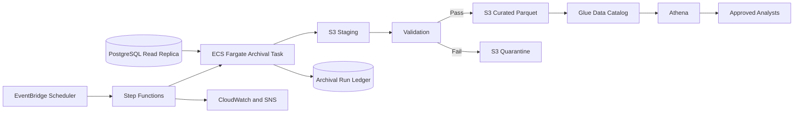

# Design Doc: Periodic Archival of `requests` Table to Amazon S3

**Status:** Draft for review  
**Owner:** Priyanka Settipalli  
**Owning team:** Data Engineering  
**Related issue:** #175  
**Database:** PostgreSQL, exact version pending confirmation  
**AWS Region:** `eu-west-1` (Ireland), pending final confirmation  

---

## 1. Problem Statement and Goals

The operational `requests` table grows continuously and is used by the matching workflow. Most records are rarely needed after a request is serviced, but they remain in PostgreSQL and continue increasing table size, index size, backup time, and storage cost.

Historical analytics also cannot safely run against the operational database because large queries may compete with live application traffic.

### Goal

Create a daily archival process that moves aged, completed request records to Amazon S3 in a queryable and privacy-controlled format. AWS Glue will catalog the data, and analysts will query it through Amazon Athena.

### Definition of done

The solution is complete when:

- all eligible records are archived within the freshness SLA;
- source and archive counts reconcile;
- retries do not create duplicate current records;
- prohibited PII is absent from the curated dataset;
- analysts can query the archive through Athena;
- failed batches do not advance the watermark;
- monitoring and alerts are active;
- source deletion remains disabled until separately approved.

### Non-goals

- Real-time CDC or streaming analytics
- Replacing PostgreSQL
- Selecting a BI tool
- Archiving other tables in this implementation
- Building the pipeline as part of this design issue
- Immediate deletion from PostgreSQL

The orchestration, manifest, monitoring, lifecycle, and schema-versioning patterns should be reusable for future archival of `matches`, `volunteers`, and `donations`. Each table will still require its own eligibility, retention, PII, and deletion rules.

---

## 2. Requirements

### Functional requirements

**Eligible records**

```sql
serviced_date IS NOT NULL
AND serviced_date < CURRENT_TIMESTAMP - INTERVAL '90 days'
```

The 90-day threshold will be stored in AWS Systems Manager Parameter Store and must be confirmed by the application and compliance owners.

**Cadence**

Run once per day at approximately 01:00 UTC.

Daily processing is preferred over hourly processing because the stated analytics use cases do not require real-time freshness. Weekly processing would create larger batches and a longer reporting delay.

**Load method**

Use incremental extraction based on `last_update_date`, not a recurring full-table snapshot.

```sql
SELECT *
FROM requests
WHERE serviced_date IS NOT NULL
  AND serviced_date < :archive_cutoff
  AND last_update_date > :previous_watermark
  AND last_update_date <= :current_watermark;
```

The watermark advances only after the batch is validated and published successfully.

**Updates**

If an archived record changes, it is exported again. The curated Athena view returns only the latest version by `req_id` and `last_update_date`.

**Deletes**

Hard deletes in PostgreSQL are not automatically reflected in S3 in the first release. Supporting synchronized deletion would require a soft-delete field, deletion-audit table, CDC, or periodic reconciliation.

### Non-functional requirements

| Requirement | Proposed target |
|---|---|
| Analytics freshness | Eligible records available by 06:00 UTC after the daily run |
| Staleness alert | Alert if no successful publication occurs within 29 hours |
| Idempotency | Retrying a batch must not create duplicate current records |
| Recovery | Failed batch reruns from the last successful watermark |
| Source impact | Read from a PostgreSQL replica and monitor replica lag |
| Encryption | TLS in transit and SSE-KMS at rest |
| Initial cost ceiling | Below $100/month at current scale, excluding a new read replica |
| Retention | Proposed 10 years, pending compliance approval |

---

## 3. Proposed Architecture



### Extraction

Use a scheduled watermark-based SQL query against a read replica.

**Why selected**

- simpler than CDC;
- easier to test and recover;
- lower operational overhead;
- sufficient for daily analytics;
- avoids large reads against the primary database.

**Tradeoff**

A watermark query cannot detect a row that is physically deleted before extraction. This remains an open policy decision.

### Orchestration

- **EventBridge Scheduler:** starts the daily workflow.
- **Step Functions:** coordinates extraction, validation, publication, retries, and alerts.
- **ECS Fargate:** runs the extraction and Parquet-writing container.
- **CloudWatch and SNS:** provide metrics, logs, and alerts.

Fargate is preferred over Lambda because historical backfills may run longer and need more memory and temporary storage.

### S3 layout

```text
s3://<company>-request-archive-<environment>/
├── staging/batch_id=<batch-id>/
├── curated/submission_year=YYYY/submission_month=MM/
├── quarantine/batch_id=<batch-id>/
└── audit/run_date=YYYY-MM-DD/
```

### Partitioning

Partition by `submission_year` and `submission_month`.

`submission_date` is stable, while status can change. Region remains a normal column initially to avoid creating many small partitions.

### File format

Use Parquet with Snappy compression.

Parquet allows Athena to read only required columns and provides lower scan and storage cost than CSV.

Target file size:

```text
128 MB to 512 MB compressed
```

### Catalog and query layer

AWS Glue stores the curated schema and partition metadata. Analysts query the curated table or a latest-record view through Athena.

### Lifecycle

| Object age | Storage class |
|---|---|
| 0–30 days | S3 Standard |
| 31–365 days | S3 Standard-IA |
| Older than one year | Glacier Flexible Retrieval or Deep Archive |
| After 10 years | Delete, subject to retention approval |

Glacier reduces storage cost but introduces restore delay. The final Glacier tier depends on how often analysts query data older than one year.

---

## 4. Schema Handling

### Source-to-archive mapping

| Source column | Archive field | Decision |
|---|---|---|
| `req_id` | `request_id` | Retain |
| `req_user_id` | `requester_hash` | Pseudonymize |
| `req_for_id` | `beneficiary_hash` | Pseudonymize |
| `req_islead_id` | `lead_hash` | Pseudonymize |
| `req_cat_id` | `category_id` | Retain |
| `req_type_id` | `type_id` | Retain |
| `req_priority_id` | `priority_id` | Retain |
| `req_status_id` | `status_id` | Retain |
| `req_loc` | `request_region` | Generalize |
| `iscalamity` | `is_calamity` | Retain |
| `req_subj` | — | Drop |
| `req_desc` | — | Drop |
| `req_doc_link` | — | Drop |
| `audio_req_desc` | — | Drop |
| `submission_date` | `submission_timestamp_utc` | Retain |
| `serviced_date` | `serviced_timestamp_utc` | Retain |
| `last_update_date` | `source_updated_timestamp_utc` | Retain |
| `to_public` | `is_public` | Retain |

Additional archive fields include `archive_batch_id`, `archive_ingested_at`, `archive_schema_version`, and `privacy_policy_version`.

### PostgreSQL-to-Parquet type mapping

| PostgreSQL type | Parquet/Athena type | Rule |
|---|---|---|
| `varchar`, `text` | `string` | UTF-8 |
| `integer` | `int` | Preserve |
| `bigint` | `bigint` | Preserve |
| `boolean` | `boolean` | Preserve |
| `numeric(p,s)` | `decimal(p,s)` | Preserve precision and scale |
| `uuid` | `string` | Store canonical UUID |
| `timestamp without time zone` | `timestamp` | Interpret using confirmed source timezone, then convert to UTC |
| `timestamp with time zone` | `timestamp` | Normalize to UTC |
| `json/jsonb` | structured fields or `string` | Requires explicit mapping |

### Schema evolution

- **New column:** review for PII and analytics value before adding; older files return null.
- **Removed column:** retain in the historical schema until downstream users migrate.
- **Retyped column:** stop publication and require a manual migration decision.
- **Renamed column:** update the explicit source-to-archive mapping.
- **Unexpected schema change:** block the batch and alert Data Engineering.

Glue schema changes must be deployed explicitly rather than accepted automatically from a crawler.

---

## 5. PII and Privacy

The proposed deployment region is Ireland, and the dataset may contain personal data. The archive must follow data-minimization and GDPR-oriented access controls.

| Column | Decision | Reason |
|---|---|---|
| `req_user_id` | Keyed HMAC | Supports unique-user analysis without exposing raw IDs |
| `req_for_id` | Keyed HMAC | Preserves linkage for approved analytics |
| `req_islead_id` | Keyed HMAC | Supports volunteer reach analysis |
| `req_loc` | Keep only approved region level | Needed for geographic demand reporting |
| `req_subj` | Drop | Free text may contain personal or sensitive data |
| `req_desc` | Drop | Free text may contain health or personal circumstances |
| `audio_req_desc` | Drop | High risk of sensitive personal information |
| `req_doc_link` | Drop | May provide access to sensitive uploaded documents |

Use HMAC-SHA-256 rather than an unkeyed hash. The secret must be stored in AWS Secrets Manager or protected by KMS and must not appear in code, logs, manifests, or container images.

### Security controls

- SSE-KMS encryption for S3
- TLS for PostgreSQL and AWS connections
- S3 Block Public Access
- bucket policy denying unencrypted uploads
- least-privilege IAM roles
- analysts restricted to the curated Athena table
- CloudTrail and service-access logging
- no direct analyst access to staging or quarantine data

The proposed PII decisions require privacy or compliance approval.

---

## 6. Alternatives Considered

### AWS DMS with CDC

**Pros:** Managed replication, captures updates and deletes, supports lower latency.

**Cons:** Continuous infrastructure, more monitoring, small-file and compaction concerns, and a separate PII-processing stage.

**Decision:** Not selected because daily batch freshness is sufficient.

### Debezium or Kinesis streaming

**Pros:** Near-real-time change history and delete capture.

**Cons:** Requires Kafka/Kinesis infrastructure, greater support burden, and event compaction before analytics.

**Decision:** Not selected because streaming is outside scope.

### Fivetran or Airbyte

**Pros:** Faster connector setup and built-in state management.

**Cons:** Licensing or hosting cost, vendor review, less control over S3 layout, and custom PII logic is still required.

**Decision:** Not selected because the design requires custom privacy and publication controls.

### Native PostgreSQL or RDS export

**Pros:** Useful for a large one-time historical backfill.

**Cons:** Not naturally incremental and requires a separate privacy-transformation step.

**Decision:** May be evaluated for backfill only, not daily archival.

---

## 7. Failure Modes and Observability

### Failure behavior

| Failure | Behavior |
|---|---|
| Task stops halfway | Files remain in staging; watermark is unchanged |
| Validation fails | Batch is quarantined and not visible to analysts |
| Glue update fails | Retry catalog publication without re-extracting |
| Duplicate schedule starts | Run ledger permits only one active batch |
| Replica unavailable | Retry with backoff, then alert |
| Schema drift | Stop publication and require review |
| Forbidden PII appears | Block batch and raise a high-severity alert |

### Duplicate prevention

- unique batch ID;
- watermark committed only after successful publication;
- `req_id` retained in every record;
- latest-record Athena view;
- failed batches excluded from the curated prefix;
- batch manifest records the exact extraction range and output files.

### Metrics

Track:

- last successful run;
- archive freshness;
- eligible, extracted, and published rows;
- source-to-output count difference;
- files and average file size;
- task duration;
- replica lag;
- schema and PII failures;
- Athena scan volume;
- estimated monthly cost.

### Alerts

Alert when:

- a run fails;
- the archive exceeds the freshness SLA;
- row counts do not match;
- replica lag is unsafe;
- an unexpected schema change occurs;
- prohibited PII is detected;
- monthly cost exceeds the approved threshold.

Proposed on-call owner: Data Engineering, pending confirmation.

---

## 8. Cost Estimate

Production row count and row size are not yet available. The following is an assumption-based planning estimate and must be replaced after profiling.

### Assumptions

- current archive: 10 million rows;
- average source row: 2 KB;
- Parquet size after column removal and compression: approximately 30% of source size;
- current compressed archive: approximately 6 GB;
- 100 Athena queries per month;
- average Athena scan: 0.5 GB per query;
- existing read replica is available.

| Service | Current scale | 10× scale |
|---|---:|---:|
| S3 storage | $0.15–$0.50/month | $1.50–$5/month |
| S3 requests | <$1/month | $1–$5/month |
| Athena scans | ~$0.25/month | ~$10/month |
| ECS Fargate | $3–$10/month | $20–$60/month |
| Step Functions | <$1/month | <$2/month |
| Glue Data Catalog | Likely $0 | $0–$2/month |
| CloudWatch and KMS | $2–$6/month | $5–$20/month |
| **Estimated total** | **$6–$20/month** | **$38–$104/month** |

These estimates exclude the cost of creating a new PostgreSQL read replica. If one must be provisioned solely for archival, it may be the largest cost.

The proof of concept must measure actual Parquet compression, Fargate runtime, and Athena scan volume.

---

## 9. Rollout and Rollback Plan

### Phase 1: Discovery

Confirm database version, indexes, row count, growth rate, timezone, terminal-state behavior, retention, PII policy, and read-replica availability.

### Phase 2: Proof of concept

Extract a representative sample, apply PII transformations, create Parquet, register Glue metadata, query with Athena, and measure cost.

### Phase 3: Shadow run

Run against the production read replica but publish only to a test prefix. Compare source and archive counts for at least seven successful daily runs.

### Phase 4: Historical backfill

Archive existing eligible records in monthly or primary-key ranges and reconcile each batch.

### Phase 5: Daily cutover

Enable the production schedule and allow analysts to validate the curated dataset. Keep source deletion disabled for at least 30 days.

### Phase 6: Decommission old process

If a manual export or temporary reporting process exists, run it in parallel during validation. Retire it only after counts reconcile, analysts approve the replacement, and the current process owner signs off.

### Phase 7: Controlled source-deletion pilot

Deletion requires a separate approval. Test a small cohort, use small transactions, confirm restore capability, and monitor application and database impact.

### Rollback

Before source deletion:

- disable the schedule;
- quarantine bad files;
- restore the previous watermark;
- correct the pipeline;
- rerun from PostgreSQL.

After source deletion, recovery may require database point-in-time restore or selective row restoration. The curated archive is not a complete operational backup because sensitive fields are removed.

---

## 10. Open Questions

1. What is the exact PostgreSQL version?
2. Is `eu-west-1` the confirmed production region?
3. Is a read replica already available?
4. What are the current row count, average row size, and monthly growth?
5. Is 90 days the approved archive threshold?
6. Is 10 years the approved retention period?
7. Does `serviced_date` always mean a request is fully closed?
8. Can serviced requests be reopened?
9. Is `last_update_date` updated for every change?
10. Are source timestamps stored in UTC?
11. Can request rows be physically deleted?
12. Should source hard deletes be reflected in S3?
13. What geographic level is approved for `req_loc`?
14. Is irreversible pseudonymization sufficient?
15. Who approves the GDPR and PII decisions?
16. Is Glacier restore delay acceptable for data older than one year?
17. Who owns the pipeline on-call?
18. What is the approved cost ceiling?
19. How long must the archive run before source deletion can begin?
20. Does the archive need legal-hold support?

---

## Acceptance Criteria

- A reviewer outside Data Engineering can understand the proposed solution and tradeoffs.
- Functional and non-functional requirements are documented.
- The architecture includes extraction, orchestration, S3, Glue, Athena, and lifecycle design.
- PII handling contains an explicit decision for every known sensitive column.
- Schema evolution and PostgreSQL-to-Parquet type mapping are documented.
- Failure recovery and idempotency are defined.
- Current and 10× cost estimates are included.
- At least two alternatives are evaluated.
- Rollout, decommissioning, and rollback steps are documented.
- The design is reviewed and approved by Data Engineering and privacy/compliance stakeholders.
